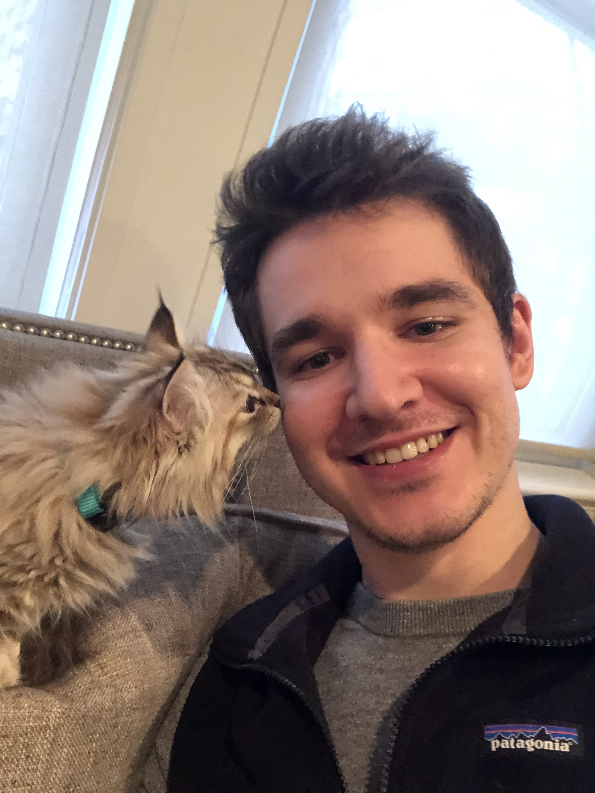
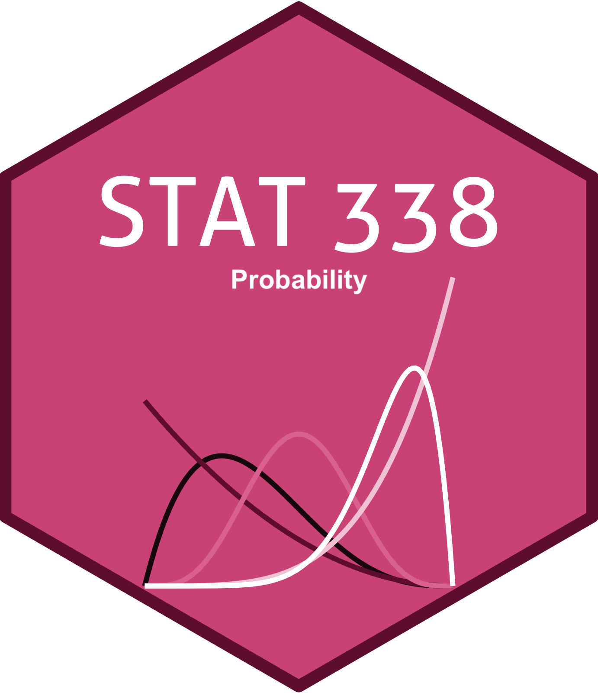
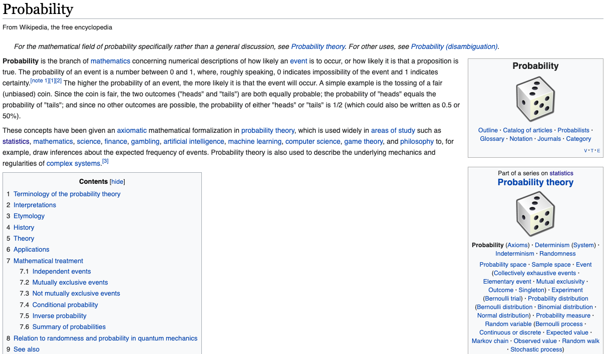
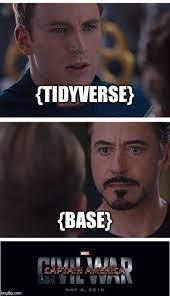

```{r xaringan-themer, include = FALSE}
library(xaringanthemer)
library(xaringanExtra)

mono_accent(base_color = "#5E5E5E") #3E8A83?
options(htmltools.preserve.raw = FALSE)

# collapseoutput.js from https://gist.github.com/emitanaka/eaa258bb8471c041797ff377704c8505#file-collapseoutput-js
```

```{r xaringan-panelset, echo=FALSE}
xaringanExtra::use_panelset()
```

```{r, echo = FALSE}
knitr::opts_chunk$set(
  message = FALSE, warning = FALSE
)
```

```{r, include = FALSE}
library(tidyverse)
library(mosaic)
```

<!--
pagedown::chrome_print("~/Dropbox/Teaching/03-Simmons Courses/MATH228-Introduction to Data Science/Lecture Slides/01-Introduction/01-Introduction.html")
-->

class: center, middle, frame

# Introduction

---

# Who am I?

.pull-left[

**Anthony Scotina** (he/him)

- Asst. Prof of Statistics

- Website/blog: [https://scotinastats.rbind.io/](https://scotinastats.rbind.io/)

- **Fun fact**: One of my *favorite* classes as an undergrad was *Probability*

- I used to have many hobbies, but all I do these days is use **R**. 

<br>

- I have an 11-month old cat named **Moose**!
]

.pull-right[
```{r, echo = FALSE}

```

]

---

# Where are you?

.center[
## Probability!!!

```{r, echo = FALSE, out.width = "45%"}

```
]

---

# Where are you?

.center[
```{r, echo = FALSE}

```
]

---

# Some Information

**Grading**

- **Problem Sets** [20%]: Roughly weekly problem sets involving both analytical and computational exercises

- **Take Home Exams** [40%]: See syllabus for dates!

- **Mini-projects** [40%]: Two blogpost-style projects will be assigned throughout the semester. 

--

**Student Hours**

- **Wednesday**, 12pm-1pm (in-person or on Zoom)

- **Thursday**, 11am-1pm (Zoom only)

- or by appointment, or whenever you see my office door open!

--

**Please read through the syllabus and let me know if you have any questions!**

---

# Activity #1 (Rock-paper-scissors)

- In *pairs of two*, play **20 games of rock-paper-scissors**. 

- Write down your choice after each throw (*R*, *P*, or *S*)

--

- Identify your *longest sequence of consecutive throws*!

--

<br>

.details[
```{r}
rps = sample(c("R", "P", "S"), size = 20, replace = TRUE)
rps
```
]

---

# Activity #1 (Rock-paper-scissors)

.panelset.sideways[
.panel[.panel-name[Plot]
`)
]
.panel[.panel-name[R Code]
```{r rps, fig.show='hide', fig.width = 5, fig.height = 4, dpi = 300}
trials = replicate(10000, {
  example = sample(c("R", "P", "S"), size = 20, replace = TRUE)
  max(rle(example)$lengths)
})

gf_histogram( ~ trials, binwidth = 1, color = "white") + 
  scale_x_continuous(breaks = scales::pretty_breaks()) + 
  labs(x = "Longest run", 
       y = "Number of simulations", 
       title = "20 games of RPS") +
  theme_bw()
```
]

]

---

# Activity #1 (Rock-paper-scissors)

.panelset.sideways[
.panel[.panel-name[Plot]
`)
]
.panel[.panel-name[R Code]
```{r rps3, fig.show='hide', fig.width = 5, fig.height = 4, dpi = 300}
trials = replicate(10000, {
  example = sample(c("R", "P", "S"), size = 5, replace = TRUE)
  max(rle(example)$lengths)
})

gf_histogram( ~ trials, binwidth = 1, color = "white") + 
  scale_x_continuous(breaks = scales::pretty_breaks()) + 
  labs(x = "Longest run", 
       y = "Number of simulations", 
       title = "5 games of RPS") +
  theme_bw()
```
]

]

---

# Activity #1 (Rock-paper-scissors)

.panelset.sideways[
.panel[.panel-name[Plot]
`)
]
.panel[.panel-name[R Code]
```{r rps2, fig.show='hide', fig.width = 5, fig.height = 4, dpi = 300}
trials = replicate(10000, {
  example = sample(c("R", "P", "S"), size = 100, replace = TRUE)
  max(rle(example)$lengths)
})

gf_histogram( ~ trials, binwidth = 1, color = "white") + 
  scale_x_continuous(breaks = scales::pretty_breaks()) + 
  labs(x = "Longest run", 
       y = "Number of simulations", 
       title = "100 games of RPS") +
  theme_bw()
```
]

]

---

# Activity #2 (Coin flips)

I need **two volunteers**!

- *Volunteer 1*: You'll be the "Judge of Randomness"

- *Volunteer 2*: You'll write a sequence of "0"s and "1"s on the board that are supposed to look like the results of 20 coin flips. 

(I'll also write a sequence of "0"s and "1"s on the board!)

--

.details[
```{r}
sample(0:1, size = 20, replace = TRUE)
```
]

---

# Activity #2 (Coin flips)

.panelset.sideways[
.panel[.panel-name[Plot]
`)
]
.panel[.panel-name[R Code]
```{r fake_coin, fig.show='hide', fig.width = 5, fig.height = 4, dpi = 300}
coin_flips_runs = replicate(10000, {
  flips = sample(0:1, size = 20, replace = TRUE)
  c(max(rle(flips)$lengths), 
    length(rle(flips)$values))
}, simplify = FALSE)

coin_flips = do.call(rbind.data.frame, coin_flips_runs)
names(coin_flips) = c("max_runs", "num_runs")

gf_jitter(max_runs ~ num_runs, data = coin_flips, 
          alpha = 0.4) + 
  labs(x = "Number of unique runs", 
       y = "Longest run", 
       title = "Simulating 20 coin tosses", 
       subtitle = "10,000 times") +
  theme_bw()
```
]

]

---

class: center, middle, frame

# Some {base} R Basics

```{r, echo = FALSE}

```

---

# Vectors

R is built around **vectors**, which are probably the single-most important data structure you'll need to understand for this class. 

--

**Examples**

```{r, echo = FALSE}
c(3, 3, 8, 3, 3, 9)

1:10

seq(2, 20, by = 2)

c("I", "have", "a", "cat", "named", "Moose")

c(TRUE, TRUE, FALSE, FALSE, TRUE)
```

--

Vectors can take elements of *multiple types* (e.g., `numeric`, `character`, `logical`). 

- But each vector's elements must *all* be the **same type**. 

---

# Creating Vectors

There are *many*, **many** ways to create vectors. One way is via the `c()` function:

```{r, eval = FALSE}
c(3, 3, 8)

c("I", "have", "a", "cat", "named", "Moose")

c(TRUE, TRUE, FALSE, FALSE, TRUE)

c("Heads", "Tails")
```

- Each element is separated by a **comma**, and the *output* is a vector. 

---

# Creating Vectors: `a:b`

There are other ways to create vectors that can be *much* more useful than entering individual elements into `c()`. 

- The `:` operator can be used to generate a sequence of *integers* from a **starting** value to an **end** value.

```{r}
1:10

0:1

-1:4
```

---

# Creating Vectors: `seq()`

The `seq()` function is a *generalization* of the `:` operator, and allows us to enter the *length* of increments ourselves. 

```{r}
seq(1, 10, by = 1) # This is identical to 1:10
```

```{r}
seq(1, 10, by = 2)
```

```{r}
seq(1, 10, by = 0.5)
```


---

# Creating Vectors: `rep()`

The `rep()` function **repeats** things! The output is *still* a vector, though. 

```{r}
rep(338, times = 5)

rep("Moose", times = 5)
```

--

We can also *nest* a vector within `rep()`:

```{r}
rep(c("Heads", "Tails"), times = 5)
```

- Instead of `times = 5`, use `each = 5` if you want `"Heads"` and `"Tails"` to each appear consecutively. 

---

# Vector Operations

At its core, R is a big, *fancy* statistical calculator. 

- While we can **add**, **subtract**, **multiply**, and **divide** numbers like you can in any calculator, we can also perform these operations (and more!) on vectors. 

```{r}
c(1, 2, 3, 4, 5) + c(6, 7, 8, 9, 10)
```

```{r}
c(1, 2, 3, 4, 5) * c(6, 7, 8, 9, 10)
```

- 🚨 **Note**: Make sure vectors are the same *length* when doing this!

---

# Assignment

We can store vectors under an **alias** so we don't have to keep typing out `c()`, `seq()`, etc. 

```{r}
my_vec = c(1, 2, 3, 4, 5)
```

--

```{r}
my_vec^2

my_vec + my_vec

rep(my_vec, 2)
```

---

# Logical Vectors

**Logical** vectors are made up of only *two unique "logical" elements*: 

- `TRUE` or `FALSE`

--

"Under the hood", `TRUE` and `FALSE` have values of `1` and `0`, respectively. 

```{r}
c(TRUE, FALSE) + c(TRUE, FALSE)

mean(c(TRUE, TRUE, TRUE, FALSE, FALSE))
```

---

# Logical Operators

Let's create two objects to use with some *logical tests*:

```{r}
moose_age = 1 # rounding up
anthony_age = 31 # rounding down
```

--

Here are some commonly-used **logical operators**

- `==`: equal to
- `!=`: not equal to
- `>`: greater than
- `>=`: greater than or equal to
- `<`: less than
- `<=`: less than or equal to
- `%in%`: true if a value is **in** a vector

---

# Logical Operators

The `==` operator asks whether two objects are **equal**. 

The code below tests the following:

> Moose's age equals Anthony's age. 

```{r}
moose_age == anthony_age
```

--

> Moose's age does *not* equal Anthony's age. 

```{r}
moose_age != anthony_age
```

--

> "Moose's age is greater than Anthony's age. 

```{r}
moose_age > anthony_age
```

---

# Combining Logicals

We can combine *several* logical operators to check multiple conditions!

- `&` for **and**, `|` for **or**

The code below tests the following:

> Moose's age is less than Anthony's age **and** Moose's age is less than 5. 

```{r}
(moose_age < anthony_age) & 
  (moose_age < 5)
```

--

> Moose's age is less than Anthony's age **or** Anthony's age is less than 30. 

```{r}
(moose_age < anthony_age) | 
  (anthony_age < 30)
```

---

# Indexing Vectors

To examine or use *specific* elements in a vector, we need to identify its **index**. 

Let's randomly sample some data from a **binomial distribution** (more on this later!!!). 

```{r}
set.seed(338) # To control R's random number generator
my_sample = rbinom(n = 1000, size = 20, prob = 0.5)
```

--

<br>

To examine a *single* element from `my_sample`, indicate the *index* you'd like in **square brackets**:

```{r}
my_sample[338]
```

- The 338th element in the `my_sample` vector is `8`. 

---

# Indexing Vectors

We can supply *vectors* within the square brackets to index *multiple elements*:

```{r}
my_sample[330:339]
```

- The output above gives the 330th *through* the 339th elements of `my_sample`. 

---

# Indexing Vectors (with logicals)

When working with large vectors, it can be useful to select elements that satisfy some condition(s). 

- Suppose we wanted to extract *only* the elements of `my_sample` that are **greater than 12**. 

--

<br>

```{r}
my_sample[my_sample > 12]
```

- By indexing on a *logical*, we extract only the indices that are set to `TRUE` in `my_sample > 12`. 

---

# Practice

> Extract *only* the elements of `my_sample` that are *greater than 12* **OR** *less than or equal to 5*. 

--

**Solution**:

```{r}
my_sample[my_sample > 12 | my_sample <= 5]
```

---

# Some Other Useful Functions

- `mean()`: calculate the **mean** of a vector

```{r}
mean(my_sample)
```

- `sum()`: calculate the **sum** of a vector

```{r}
sum(my_sample)
```

- `length()`: calculate the **length** (e.g., *sample size*) of a vector

```{r}
length(my_sample)
```

- plus many more!

---

# The `%in%` Operator

The `%in%` operator is *very useful* for checking whether *multiple* elements occur in a vector. 

Recall `my_sample`. Let's check whether each element equals either `5`, `10`, or `15`:

```{r, eval = FALSE}
my_sample == 5 | my_sample == 10 | my_sample == 15
```

- **Note**: The output is a **logical vector** that is the same length as `my_sample`. 

--

Alternatively, we could use %in%:

```{r, eval = FALSE}
my_sample %in% c(5, 10, 15)
```

---

# `sample()`

In the early part of the semester, we will use `sample()` *a ton*. 

- With `sample()`, we can **randomly select** elements from a vector *with* or *without replacement*. 

--

<br>

Let's **simulate** flipping a *fair coin* 20 times!

```{r}
coin_flips = sample(c("H", "T"), size = 20, replace = TRUE)
coin_flips
```

> What might happen if we set `replace = FALSE`?

---

# `sample()`

In the early part of the semester, we will use `sample()` *a ton*. 

- With `sample()`, we can **randomly select** elements from a vector *with* or *without replacement*. 

<br>

Next, let's simulate randomly selecting 20 numbers from 1 through 1,000. 

```{r}
sample(1:1000, size = 20, replace = FALSE)
```

> What might happen if we set `replace = TRUE`?

---

# `sample()`

In the early part of the semester, we will use `sample()` *a ton*. 

- With `sample()`, we can **randomly select** elements from a vector *with* or *without replacement*. 

<br>

Let's **simulate** flipping a *biased coin* 20 times!

```{r}
coin_flips = sample(c("H", "T"), size = 20, replace = TRUE, prob = c(0.75, 0.25))
table(coin_flips)
```

**Note**: In this simulation, the `"H"` has a 75% chance of being selected. 

---

# `which()`

The `which()` function allows us to see *which* indices in a vector satisfy some logical condition. 

- The result is a vector of **indices**, *not* elements!

--

<br>

Using the *biased* coin from the previous slide, let's see when we saw our first "Tails"

```{r}
which(coin_flips == "T")

which(coin_flips == "T")[1] # Gives the first result only
```
