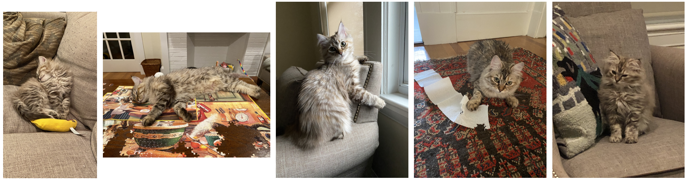
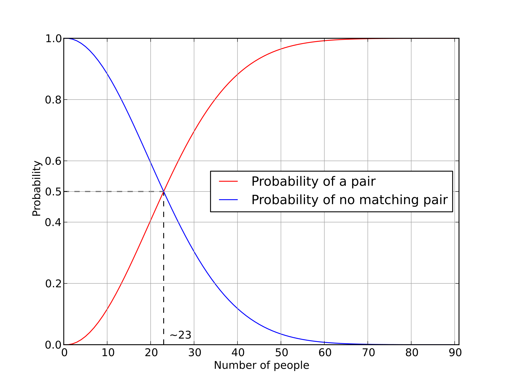
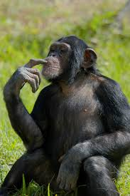
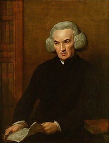

```{r xaringan-themer, include = FALSE}
library(xaringanthemer)
mono_accent(base_color = "#5E5E5E") #3E8A83?
options(htmltools.preserve.raw = FALSE)
```

```{r, echo = FALSE}
knitr::opts_chunk$set(
  message = FALSE, warning = FALSE
)
```

```{r, include = FALSE}
library(tidyverse)
library(gt)
```

<!--
pagedown::chrome_print("~/Dropbox/Teaching/03-Simmons Courses/MATH228-Introduction to Data Science/Lecture Slides/01-Introduction/01-Introduction.html")
-->

class: center, middle, frame

# The "Naive" Definition of Probability

---

# Experiments

An **experiment** is the (very general) process that produces an *observation*. 

- tossing a coin or die, taking some measurement of an individual, Spotify shuffle (eh, [kinda](https://www.businessinsider.com/spotify-made-shuffle-feature-less-random-to-actually-feel-random-2020-3)...), etc.


- We know the observations that *could* happen, but we don't know which particular observation *will* happen. They are **random**!

---

# Events

Performing an experiment (e.g., tossing a coin) can result in one or more possible outcomes. 

- We call these **events**, and usually denote them with *capital letters*.

--

**Example**

Toss a die and observe the number of dots on the top face. 

- One possible event is: $$A = \text{roll an even number} = \{2, 4, 6\}$$

- Another event: $$B = \text{roll a five} = \{5\}$$

--

**Note**

- Event $A$ is a *compound event* and can be decomposed into smaller *simple events*. 

---

# Sample Space

The **sample space** is the set of *all possible outcomes* of an experiment. 

- This will *always* be denoted by the letter $S$. 

--

**Examples**

- Tossing a die: $$S = \{1, 2, 3, 4, 5, 6\}$$

--

- Choosing which pic of Moose to show to STAT 338:

.center[

```{r, echo = FALSE, dpi = 300}

```

]

---

# 🚧 Set Theory Detour 🚧

*Set Theory*: The language of sets will give us a clear and precise way to work with events. 

- Events themselves are **sets**!

--

**Definitions** 💻️

Let $A$ and $B$ be events in the sample space $S$.

1. **Intersection**: $A\cap B$ is the set of events that are in **both** $A$ *and* $B$. 

2. **Union**: $A\cup B$ is the set of events that are in **either** $A$ *or* $B$ (or *both*). 

3. $A$ is a **subset** of $B$, $A\subset B$, if every element of $A$ is also an element of $B$. 

4. The **empty set**, $\emptyset$, is the set consisting of *no points*. 
    - The empty set is also a subset of every set!
    
5. The **complement** of $A$, written as $\bar{A}$, is the set of points in $S$ *but not in* $A$. 

6. $A$ and $B$ are **disjoint/mutually exclusive** if $A\cap B = \emptyset$. 

---

# Practice

Consider the experiment of picking a random card from a standard deck of 52 cards, and the following four events:

- *A*: card is a heart

- *B*: card is a diamond

- *C*: card is an ace

- *D*: card is black

1. Describe the events $A\cap C$ and $A\cup C$. 

2. Describe the events $A\cap B$ and $A\cup B$. 

3. Describe $(A\cup B)\cap (A\cup C)$. 

4. Describe the relationship between $A\cup B$ and $D$. 

---

# Okay, so what is probability?!

The "simple" definition of the **probability** of an event, dating back centuries, was to...

- **count** up the number of ways an event could happen, and...

- divide by the **total number of possible outcomes** of an experiment. 

This is the **naive definition of probability**: For an event $A\subset S$, $$P(A) = \frac{\text{number of outcomes favorable to } A}{\text{total number of outcomes in } S}$$

--

<br>

Why *naive*?

- *S* must be **finite**. 

- Each unique element of *S* is **equally likely**. 

---

class: center, middle, frame

# Counting

---

# How to count

Sometimes when using the **naive definition of probability**, calculating the sizes of $A$ and $S$ is straightforward. 

- **Example**, toss a coin twice and calculate the *probability that both coins landed on "heads"*.

- *S* $=$ {HH, HT, TH, TT}

--

Often the sets we'll need to count are *extremely large*, and we can't simply list out all possible outcomes. 

- **Example**: What is the probability of a *full house* in poker?

.center[

]

---

# Multiplication (mn) Rule

Consider two sub-experiments *A* and *B* with *a* and *b* possible outcomes, respectively.

- **Then the compound experiment with *A* and *B* has *ab* possible outcomes.**

--

<br>

**Example** (Ice cream cones from *Blitzstein and Hwang*)

> Suppose you are buying an ice cream cone. You can choose whether to have:

> - chocolate, vanilla, or strawberry as your flavor, 

> - a cake cone or a waffle cone, 

> - rainbow, chocolate, or no sprinkles

> How many different ice cream cone/flavor/sprinkle combinations are available?

---

# Multiplication (mn) Rule

Consider two sub-experiments *A* and *B* with *a* and *b* possible outcomes, respectively.

- **Then the compound experiment with *A* and *B* has *ab* possible outcomes.**

<br>

**Example** (Runners from *Blitzstein and Hwang*)

> Suppose that 10 people are running a race. Assume that no ties are possible, and each runner finishes the race. 

> How many possibilities are there for the first, second, and third place winners?

---

# The Birthday Problem

There are *21* people in a room (e.g., this room...). Assume:

(i) each person's birthday is equally likely to be any of the 365 days of the year (sorry, leap year birthdays!)

(ii) birthdays are *independent*

Find the probably that at least one pair of people in the group have the same birthday. 

**What to count**:

1. The number of **TOTAL** ways to assign birthdays to the 21 people in the room. 
    - This is the *denominator* of the naive definition of probability. 

2. The number of ways to assign birthdays to 21 people *such that there are two people who share a birthday*. 
    - This is the number of "favorable" outcomes.
    - Maybe it'll be easier to find the **complement**...
    
---

# The Birthday Problem

There are *21* people in a room (e.g., this room...). Assume:

(i) each person's birthday is equally likely to be any of the 365 days of the year (sorry, leap year birthdays!)

(ii) birthdays are *independent*

Find the probably that at least one pair of people in the group have the same birthday. 

🚨The number of ways we can choose *k* objects from *n* total objects **without replacement** (*when order matters*) is given by $$P_{k}^{n}=n(n-1)(n-2)\cdots(n-k+1)=\frac{n!}{(n-k)!}$$

---

# The Birthday Problem

.center[
```{r, echo = FALSE, out.width = "75%"}

```
]

---

# The Binomial Coefficient and Overcounting

Consider the following two examples:

1. In a committee with *n* members, how many ways are there to choose a president, vice president, and treasurer?

2. In a committee with *n* members, how many ways are there to choose three *officers* of equal rank?

--

<br>

🚨The number of ways we can choose *k* objects from *n* total objects (*when order doesn't matter*) is given by $$\binom{n}{k}=C_{k}^{n}=\frac{n!}{k!(n-k)!}$$

- We can find this number in R with `choose(n, k)`. 

---

# Full House in Poker

Find the probability of obtaining a **full house** in poker. 

- A *full house* is a hand of five cards that contains *three cards of one rank and two cards of another rank*. 

**What to count**:

**1.**. The number of **TOTAL** possible hands of five cards. 
    - This is the *denominator* of the naive definition of probability. 
    
**2.** The number of ways we can obtain three cards of one rank and two cards of another rank. 
    - This is the number of outcomes favorable to the "full house" event. 

---

# Full House in Poker

Find the probability of obtaining a **full house** in poker. 

- A *full house* is a hand of five cards that contains *three cards of one rank and two cards of another rank*. 

**What to count**:

**1.** The number of **TOTAL** possible hands of five cards. 

- There are $\binom{52}{5}$, or `choose(52, 5)` total possible hands of five cards. 

**2.** The number of ways we can obtain three cards of one rank and two cards of another rank. 

- There are 13 ways to choose the first rank. 
- There are $\binom{4}{3}$ ways to choose *three* cards of that rank from the four suits (hearts, diamonds, clubs, spades). 
- There are 12 ways to choose the second rank (since the first was already chosen). 
- There are $\binom{4}{2}$ ways to choose *two* cards of that rank from the four suits. 

---

# Sarah the Chimp

.pull-left[
- In 1978, researchers Premack and Woodruff published a study in *Science* magazine, reporting an experiment where an adult chimpanzee named Sarah was shown videotapes of eight different scenarios of a human being faced with a problem.

- After each videotape showing, she was presented with two photographs, one of which depicted a possible solution to the problem.

- Sarah could pick the photograph with the correct solution for seven of the eight problems!
]

.pull-right[

]

---

# How?!

What are **two possible explanations** for Sarah getting 7 correct answers out of 8?

--

1. Sarah was just guessing and got lucky. 

2. Sarah can do better than just guessing. 

--

Let's try to model this study *under the assumption that Sarah was guessing*. 

.center[
```{r, echo = FALSE, out.width = "25%"}
knitr::include_graphics("coin_flip.png")
```
]

> What is the probability of flipping 7 heads in 8 coin tosses, assuming the coin is fair? 🤔

---

# Coin Tossing

> What is the probability of flipping 7 heads in 8 coin tosses, assuming the coin is fair? 🤔

.center[
```{r, echo = FALSE, out.width = "25%"}
knitr::include_graphics("coin_flip.png")
```
]

**What to count**:

1. The number of **TOTAL** possible results in 8 coin tosses. 
    
2. The number of ways we can land 7 heads in 8 coin tosses. 

---

# Simulating Probability

We can also **simulate** one possible outcome of this experiment with `sample(...)`:

- Randomly sample from `c("Heads", "Tails")` **8** times. 

- Set `replace = FALSE` to sample *without replacement*. 
    - What do you think would happen if we set `replace = TRUE`?

```{r}
results = c("Heads", "Tails")
sample(results, size = 8, replace = TRUE)
```

---

# Newton-Pepys Problem

Isaac Newton was consulted about the following problem by Samuel Pepys, who wanted the information for gambling purposes. Which of the following events has the highest probability?

- *A*: At least one 6 appears when 6 fair dice are rolled. 

- *B*: At least two 6's appear when 12 fair dice are rolled. 

- *C*: At least three 6's appear when 18 fair dice are rolled. 

--

<br>

Does the **naive definition of probability** apply?

- Is the number of possible outcomes *finite*?

- Are each of the possible outcomes *equally likely*?

---

# Simulating the Newton-Pepys Problem

For now, let's simulate **one trial** from each of the events *A*, *B*, and *C*. 

```{r}
rolls_A = sample(1:6, size = 6, replace = TRUE)
rolls_A

any_six = any(rolls_A == 6)
any_six
```

<br>

> Try simulating one trial for events *B* and *C*!

---

class: center, middle, frame

# The Axioms of Probability

---

# The Axioms of Probability

The *naive* definition can only take us so far, because it relies on *equally likely outcomes* and a *finite sample space*. 

- Here is the more **general** definition of probability that we'll rely on for the rest of the class!

<br>

Suppose $S$ is a sample space associated with an experiment. To every event $A$ in $S$, we define $P(A)$ as the **probability** of $A$ so that the following *axioms* hold:

- **Axiom 1**: $P(A)\geq0$

- **Axiom 2**: $P(S)=1$ and $P(\emptyset)=0$

- **Axiom 3**: If $A_{1},A_{2},A_{3},\dots$ form a sequence of *pairwise mutually exclusive* events in $S$ (that is, $A_{i}\cap A_{j}=\emptyset$ if $i\neq j$ ), then: $$P(A_{1}\cup A_{2}\cup A_{3}\cup \cdots)=\sum_{i=1}^{\infty}P(A_{i})$$

---

# Properties of Probability

We can use the **axioms of probability** to derive other important properties of probability!

<br>

For any events $A$ and $B$:

1.  $P(\bar{A})=1-P(A)$

2.  If $A\subset B$, then $P(A)\leq P(B)$. 

3.  (The **Additive Law of Probability**) $$P(A\cup B)=P(A)+P(B)-P(A\cap B)$$

---

# Story Proofs

Sometimes it is easier to understand **why** a result is true and *what it means* through a *proof by interpretation*, rather than through (sometimes) *tedious algebra*. 

- A **story proof** is a *proof by interpretation*!

<br>

**Some Examples**

**1.** For any nonnegative integers $n$ and $k$ with $k\leq n$, we have $$\binom{n}{k}=\binom{n}{n-k}$$

--

**2.** (*The Team Captain*) For any positive integers $n$ and $k$ with $k\leq n$, $$n\binom{n-1}{k-1}=k\binom{n}{k}$$

---

class: center, middle, frame

# Conditional Probability

---

# Motivating Example

.pull-left[
```{r, echo = FALSE}
knitr::include_graphics("titanic.jpg")
```
]

.pull-right[
The *RMS Titanic* collided with an iceberg on April 14, 1912, killing over half of the passengers and crew.

- The probability of an event (e.g., *survival*) will sometimes depend upon whether we have *additional information* about **other events** (e.g., passenger *status*). 

<br> 

**Conditional probability** shows us how we can incorporate additional "evidence" into our understanding of certain phenomena. 
]

---

# Motivating Example

**Results**

.center[
```{r, echo = FALSE}
results <- tribble(
  ~Status, ~Crew, ~First, ~Second, ~Third, ~Total,
  "Alive", "212", "201", "119", "180", "712",
  "Dead", "677", "123", "116", "530", "1446",
  "Total", "889", "324", "235", "710", "2158"
) 

results %>%
  gt() %>%
  data_color(columns = vars(Status, Crew, First, Second, Third, Total), 
             colors = c("white"))
```
]

--

Suppose we randomly select a *Titanic* passenger from the list. What is the probability that this passenger survived?

- $P(\text{Alive})=\text{?}$

---

# Motivating Example

**Results**

.center[
```{r, echo = FALSE}
results <- tribble(
  ~Status, ~Crew, ~First, ~Second, ~Third, ~Total,
  "Alive", "212", "201", "119", "180", "712",
  "Dead", "677", "123", "116", "530", "1446",
  "Total", "889", "324", "235", "710", "2158"
) 

results %>%
  gt() %>%
  data_color(columns = vars(Status, Crew, First, Second, Third, Total), 
             colors = c("white")) %>%
  tab_style(
    style = list(
      cell_fill(color = "lightcyan"),
      cell_text(weight = "bold")
      ),
    locations = cells_body(
      columns = vars(Total),
      rows = (Status == "Total"))
    ) %>%
  tab_style(
    style = list(
      cell_fill(color = "lightcyan"),
      cell_text(weight = "bold")
      ),
    locations = cells_body(
      columns = vars(Total),
      rows = (Status == "Alive"))
    )
```
]

Suppose we randomly select a *Titanic* passenger from the list. What is the probability that this passenger survived?

- $P(\text{Alive})=712/2158=0.33$

---

# Motivating Example

**Now**, let's suppose we receive *additional information*. 

- The passenger selected was *first class*. 

**Results**

.center[
```{r, echo = FALSE}
results <- tribble(
  ~Status, ~Crew, ~First, ~Second, ~Third, ~Total,
  "Alive", "212", "201", "119", "180", "712",
  "Dead", "677", "123", "116", "530", "1446",
  "Total", "889", "324", "235", "710", "2158"
) 

results %>%
  gt() %>%
  data_color(columns = vars(Status, Crew, First, Second, Third, Total), 
             colors = c("white")) 
```
]

What is the probability that this passenger survived, **given** that they were first class?

- $P(\text{Alive}\mid \text{First Class})=\text{?}$

---

# Motivating Example

**Now**, let's suppose we receive *additional information*. 

- The passenger selected was *first class*. 

**Results**

.center[
```{r, echo = FALSE}
results <- tribble(
  ~Status, ~Crew, ~First, ~Second, ~Third, ~Total,
  "Alive", "212", "201", "119", "180", "712",
  "Dead", "677", "123", "116", "530", "1446",
  "Total", "889", "324", "235", "710", "2158"
) 

results %>%
  gt() %>%
  data_color(columns = vars(Status, Crew, First, Second, Third, Total), 
             colors = c("white")) %>%
  tab_style(
    style = list(
      cell_fill(color = "lightcyan"),
      cell_text(weight = "bold")
      ),
    locations = cells_body(
      columns = vars(First),
      rows = (Status == "Total"))
    ) %>%
  tab_style(
    style = list(
      cell_fill(color = "lightcyan"),
      cell_text(weight = "bold")
      ),
    locations = cells_body(
      columns = vars(First),
      rows = (Status == "Alive"))
    )
```
]

What is the probability that this passenger survived, **given** that they were first class?

- $P(\text{Alive}\mid \text{First Class})=201/324=0.62$

---

# Conditional Probability

> *Conditioning is the soul of statistics.* 
> - Blitzstein and Hwang, 2019

The **conditional probability** of an event $A$, given that an event $B$ has occurred, is defined as $$P(A\mid B)=\frac{P(A\cap B)}{P(B)},$$ provided $P(B)>0$. 

--

- **Note**: This means that $$P(A\cap B)=P(A\mid B)P(B).$$ This will be *very important* in a little bit!

---

# Example 🎲🎲

Suppose that we toss two balanced dice. What is the probability that both dice are 4, given that the sum of the two dice is 8?

> Define these events:

> - *A*: Observe that both dice are 4

> - *B*: Observe that the sum of the two dice is 8. 

--

**Solution**

$$P(A\mid B)=\frac{P(A\cap B)}{P(B)}=\frac{1/36}{5/36}=1/5$$

--

**Practice**

🤔 What is $P(B\mid A)$?

---

# Practice

A standard deck of cards is shuffled well. We draw a two-card hand, *without replacement*. Define the following events:

- $A$: we drew two aces

- $B$: we drew an ace

- $C$: we drew the ace of diamonds

<br>

**1.** Find $P(A\mid B)$. 

<br>

**2.** Find $P(A\mid C)$. 

---

# Simulation

A standard deck of cards is shuffled well. We draw a two-card hand, *without replacement*. Define the following events:

- $A$: we drew two aces

- $B$: we drew an ace

- $C$: we drew the ace of diamonds

Simulating $P(B)$:

```{r}
cards = c(rep("Hearts", 13), rep("Diamonds", 13), 
          rep("Clubs", 13), rep("Spades", 13))
simulated_draws <- replicate(10000, {
  draw <- sample(cards, size = 2, replace = FALSE)
  draw[2] %in% c("Hearts", "Diamonds")
})

mean(simulated_draws)
```

---

# Independence

Two events are said to be **independent** if knowledge that one event occurs does not indicate whether the other event is more likely to occur. 

Formally, two events are **independent** if *any* one of the following holds:

- $P(A\mid B)=P(A)$

- $P(B\mid A)=P(B)$

- $P(A\cap B)=P(A)P(B)$

Otherwise, the events are said to be *dependent*. 

---

# Example

Consider the following events in the toss of a single die:

- *A*: Observe an odd number

- *B*: Observe an even number

- *C*: Observe a 1 or 2

<br>

> Are *A* and *B* independent events? What about *A* and *C*?

--

**Solution**

- *A* and *B* are **dependent**, because $P(A\mid B)\neq P(A)$.
    - Knowing that we observed an even number means that we **CANNOT** observe an odd number. 
    
- *A* and *C* are **independent**, because $P(A\mid C)=P(A)$. 
    - Both probabilities are equal to 1/2. 
    
---

# Multiple Indepedent Events

Suppose we roll five ordinary dice. 

> What is the probability that all of them show six?

<br>

> What is the probability that **at least one** six appears?

> - [Hint: What is the complement of this event?]


---

class: center, middle, frame

# Bayes' Rule

---

# Piéchart Disease 😨😱

It is "well-known" that *Piéchart Disease* afflicts 1% of the population. Suppose a patient gets tested for Piéchart Disease. 

**Some notation**:

- *D*: patient has the disease

- *T*: patient tests positive for the disease

**Some assumptions**:

- The test is advertised as "*95% accurate*". 
    - We're assuming this means that $P(T\mid D)=0.95=P(\bar{T}\mid \bar{D})$
    
<br>

But what *really* matters to the patient? Is it $P(T\mid D)$? 🤔

---

# Flipping the conditional

In general, $P(A\mid B)\neq P(B\mid A)$. It is *very* common to mix up these two probabilities!

- This is called the **prosecutor's fallacy**. 

- **Always be aware of your denominator, or the event on which you are conditioning!!!**

--

However, $P(A\mid B)$ and $P(B\mid A)$ *are* related through the fact that:

1. $P(A\cap B)=P(A\mid B)P(B)$

2. $P(A\cap B)=P(B\mid A)P(A)$

---

# Bayes' Rule

The probabilities $P(A\cap B)$ and $P(B\cap A)$ are *linked* through **Bayes' Rule**: $$P(A\mid B)=\frac{P(B\mid A)P(A)}{P(B)}$$

--

Some *Statistics* lore...

.pull-left[
Named after **Thomas Bayes**.

```{r, echo = FALSE}
knitr::include_graphics("bayes.jpeg")
```
]

.pull-right[
Published by **Richard Price**. 

```{r, echo = FALSE, out.width = "60%"}

```
]

---

# Piéchart Disease 😨😱

It is "well-known" that *Piéchart Disease* afflicts 1% of the population. Suppose a patient gets tested for Piéchart Disease. 

**Some notation**:

- *D*: patient has the disease

- *T*: patient tests positive for the disease

We know that $P(T\mid D)=0.95$. But what we *really* want to know is $P(D\mid T)$.

- This is the probability **that the patient has the disease**...
    - *given that they tested positive*. 

We can use Bayes' Rule for this... $$P(D\mid T)=\frac{P(T\mid D)P(D)}{P(T)}$$

--

- But what is $P(T)$?!

---

# Law of Total Probability (LTP)

The **Law of Total Probability** works *in tandem* with Bayes' Rule, and allows us to connect *unconditional* and *conditional* probabilities. 

- The LTP works by **partitioning** the sample space, *S*, into a union of **disjoint** slices.

--

A **partition** of *S* is a collection of sets $\{B_{1},B_{2},\dots,B_{k}\}$ such that:

1. $S = B_{1}\cup B_{2}\cup\cdots\cup B_{k}$

2. $B_{i}\cap B_{j}=\emptyset$ for $i\neq j$

--

If $A\subset S$, this allows us to state the LTP: $$P(A)=\sum_{i=1}^{n}P(A\mid B_{i})P(B_{i})$$

---

# Piéchart Disease 😨😱

We know that $P(T\mid D)=0.95$. But what we *really* want to know is $P(D\mid T)$.

- This is the probability **that the patient has the disease**...
    - *given that they tested positive*. 

We can use Bayes' Rule for this... $$P(D\mid T)=\frac{P(T\mid D)P(D)}{P(T)}$$

--

Now we can decompose $T$ into a union of disjoint slices: $$T=(T\cap D)\cup (T\cap \bar{D})$$

- We can use this, along with **Axiom 3** and the connection between $P(T\cap D)$ and $P(T\mid D)$ to find $P(T)$! 

---

# Practice

(WMS Exercise 2.135)

Of the travelers arriving at a small airport, 60% fly on major airlines, 30% fly on privately owned planes, and the remainder fly on commercially owned planes not belonging to a major airline. Of those traveling on major airlines, 50% are traveling for business reasons, whereas 60% of those arriving on private planes and 90% of those arriving on other commercially owned planes are traveling for business reasons. 

Suppose that we randomly select one person arriving at this airport. What is the probability that the person...

1. is traveling on business?

2. is traveling for business on a privately owned plane?

3. arrived on a privately owned plane, given that the person is traveling for business reasons?
