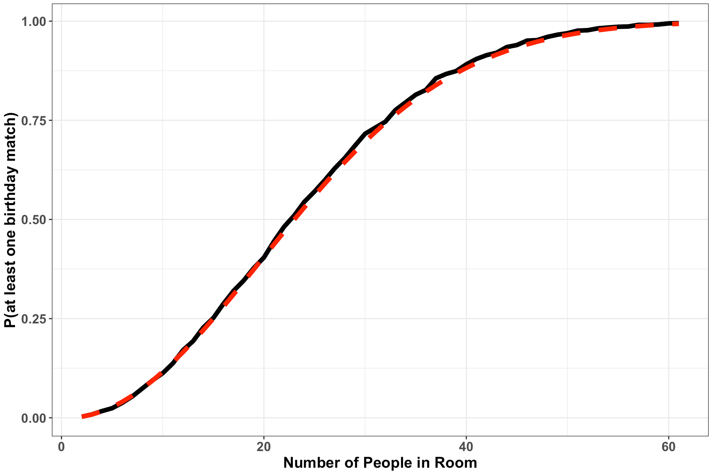

```{r xaringan-themer, include = FALSE}
library(xaringanthemer)
mono_accent(base_color = "#5E5E5E") #3E8A83?
options(htmltools.preserve.raw = FALSE)
```

```{r xaringan-panelset, echo=FALSE}
xaringanExtra::use_panelset()
```

```{r, echo = FALSE}
knitr::opts_chunk$set(
  message = FALSE, warning = FALSE
)
```

```{r, include = FALSE}
library(tidyverse)
library(mosaic)
library(gt)
```

<!--
pagedown::chrome_print("~/Dropbox/Teaching/03-Simmons Courses/MATH228-Introduction to Data Science/Lecture Slides/01-Introduction/01-Introduction.html")
-->

class: center, middle, frame

# Random Variables

---

# What is a random variable?

A **random variable (RV)** is a function from the sample space $S$ to the real numbers, $\mathbb{R}$. 

- Random variables are typically denoted by *capital letters*. 

--

Okay, what does that mean? 🤔🤔🤔

**Example**: Consider an experiment where we toss a fair coin twice. 

- Four possible outcomes: $S=\{HH, HT, TH, TT\}$

--

- Let $X=$ **number of heads**

.center[
```{r, echo = FALSE}
data.frame(Outcome = c("TT", "HT", "TH", "HH"), 
           X = c(0, 1, 1, 2)) %>%
  gt() 
```
]

- The random variable $X$ *assigns* the value 2 to the outcome $HH$. 

---

# Discrete Random Variables

For now, we'll be looking at **discrete random variables**, which assume only a *finite* or a *countably infinite* number of distinct values. 

- Intuitively, think of discrete RVs as things you can *count*. 

--

<br>

The "**random**" in "discrete random variables" arises from the *experiment itself*, rather than in saying the random variable "takes on random values"

Random variables provide *numerical summaries* of an experiment. 

- These can be *very useful* when the sample space is...
    - non-numeric
    - high-dimensional

Because such random variables can occur frequently in the real-world, it is often useful to know the *probability* for each possible value of a random variable. 

---

# Probability Mass Functions (PMFs)

The **probability distribution** of a random variable specifies the probabilities of *all* events associated with the random variables. 

.pull-left[
```{r, echo = FALSE}
data.frame(Outcome = c("TT", "HT", "TH", "HH"), 
           X = c(0, 1, 1, 2)) %>%
  gt() 
```
]

.pull-right[
```{r, echo = FALSE}
data.frame(X = c(0, 1, 2), 
           p = c(1/4, 1/2, 1/4)) %>%
  gt() %>%
  cols_label(
    p = "P(X = x)"
  )
```
]

--

While there are several ways to express the probability distribution of a *discrete* random variable (graphs, tables), the most natural way is through a **probability mass function** (PMF):

- A **probability mass function** (PMF) of a discrete RV $X$ is given by the function $$p(x)=P(X=x),$$ defined on the *support* of $X$, and 0 otherwise. 

---

```{r, echo = FALSE, eval = FALSE}
# Capture-Recapture

Suppose there are **5** elk in a (very small) forest, of which a simple random sample of **3** elk are captured and tagged. The captured elk are returned to the population, and then a new sample is drawn, this time with size **2**. 

> What is the **probability distribution** for *Y*, the number of elk in the new sample who were previously tagged?

--

**Case 1** - $Y = 0$: $$\frac{\binom{3}{0}\binom{2}{2}}{\binom{5}{2}} = 0.1$$

- There are $\binom{5}{2}=10$ ways to choose the 2 elk in the new sample out of 5 total elk. 

- There are $\binom{3}{0}=1$ way to choose 0 *tagged* elk in the new sample out of the 3 previously-captured and tagged elk. 

- There are $\binom{2}{2}=1$ way to choose the remaining 2 *untagged* elk in the new sample out of the 2 elk who were *not* previously-captured and tagged. 

---

# Capture-Recapture

Suppose there are **5** elk in a (very small) forest, of which a simple random sample of **3** elk are captured and tagged. The captured elk are returned to the population, and then a new sample is drawn, this time with size **2**. 

> What is the **probability distribution** for *Y*, the number of elk in the new sample who were previously tagged?

**Case 2** - $Y = 1$: $$\frac{\binom{3}{1}\binom{2}{1}}{\binom{5}{2}} = 0.6$$

---

# Capture-Recapture

Suppose there are **5** elk in a (very small) forest, of which a simple random sample of **3** elk are captured and tagged. The captured elk are returned to the population, and then a new sample is drawn, this time with size **2**. 

> What is the **probability distribution** for *Y*, the number of elk in the new sample who were previously tagged?

**Case 3** - $Y = 2$: $$\frac{\binom{3}{2}\binom{2}{0}}{\binom{5}{2}} = 0.3$$

---

# Capture-Recapture

For $Y=$ the number of elk in the new sample who were previously tagged, our **probability distribution** is:

.center[
{r, echo = FALSE}
data.frame(X = c(0, 1, 2), 
           p = c(0.1, 0.6, 0.3)) %>%
  gt() %>%
  cols_label(
    p = "P(Y = y)"
  )


--

We can also express this distribution with a **probability mass function** (PMF): $$p(y)=P(Y=y)=\frac{\binom{3}{y}\binom{2}{2-y}}{\binom{5}{2}},\qquad y = 0,1,2$$
]

---
```

# The Eurasian Lynx

(From *Probability, Statistics, and Data* by D. Speegle and B. Clair)

The **Eurasian lynx** (pictured below) is a wild cat that lives in the north of Europe and Asia. When a female lynx gives birth, she may have from 1-4 kittens. Our statistical experiment is a lynx giving birth, and the outcome is a litter of baby lynx. 

.pull-left[
```{r, echo = FALSE, out.width = "70%"}

```
]

.pull-right[
Baby lynx are complicated objects, but there is a simple random variable here: **the number of kittens**. 

Call this $X$. Ecologists have estimated the PMF for $X$ to be:

```{r, echo = FALSE}
data.frame(x = "p(x)", one = 0.18, two = 0.51, three = 0.27, four = 0.04) %>%
  gt() %>%
  cols_label(one = "1", two = "2", three = "3", four = "4")
```
]

---

# The Eurasian Lynx

.center[
```{r, echo = FALSE}
data.frame(x = "p(x)", one = 0.18, two = 0.51, three = 0.27, four = 0.04) %>%
  gt() %>%
  cols_label(one = "1", two = "2", three = "3", four = "4")
```
]

We can express this PMF in function notation: $$p(x)=P(X=x)=\begin{cases}0.18,&\text{if}\ x = 1\\ 0.51,&\text{if}\ x = 2\\ 0.27,&\text{if}\ x = 3\\ 0.04,&\text{if}\ x = 4\\0,&\text{otherwise}\end{cases}$$

--

<br>

😺 **Find the probability that a lynx litter has more than one kitten**. 😺

---

# Simulating Lynx Litters

We can simulate this RV with `sample()`:

```{r}
litter_probs = c(0.18, 0.51, 0.27, 0.04)
X = sample(1:4, 10000, replace = TRUE, prob = litter_probs)

mean(X > 1)
```

--

<br>

🚨 The probability distributions that we'll see in this class are **models** for population distributions that occur in nature. 

.pull-left[
> All models are wrong, but some are useful. 

> - George Box
]

.pull-right[
```{r, echo = FALSE, out.width = "40%"}

```
]

---

# PMF Properties

For *any* discrete probability distribution, the following must be true:

1.  $0\leq p(y)\leq 1$ for all $y$. 

2.  $\sum_{y}p(y)=1$, where the summation is over all values of $y$ with nonzero probability. 

---

# Practice

Let $Y$ be a discrete random variable with probability mass function given by $$p(y)=\begin{cases}1/4& y=0\\ 1/2& y=1\\ 1/8 & y=2\\ 1/8 & y=3\end{cases}$$

1. Verify that $p(y)$ is a valid PMF. 

2. Find $P(Y\geq2\mid Y\geq 1)$. 

3. Use `sample()` to simulate a sample of size 10,000 from $Y$ and *estimate* $P(Y=1)$ from your sample. Your result should be close to 1/2. 

---

class: center, middle, frame

# Expected Value

---

# Averages

The **average**, or **mean**, is a measure of *central tendency* that arises *a lot* in nature. 

We typically see this introduced via the **sample mean**: $$\bar{x}=\frac{x_{1}+x_{2}+\cdots +x_{n}}{n}$$

Or in **R**:

- Calculate the *mean* price of homes in the `house_prices` dataset from the `{moderndive}` package. 

```{r}
library(moderndive)
mean(house_prices$price)
```

---

# Averages

**Recall**: Probability *distributions* of a random variable give us complete information about the probability that the RV will take on any particular value(s). 

**Examples**:

*For some discrete RV, X*:

- $P(X > 5)$

- $P(X = 2)$

- $P(85 < X < 100)$

--

When dealing with *many* probabilities, it can often be simpler to summarize a distribution using an "average" value. 

- That's where the **expected value** comes in handy!

---

# Expected Value

Let $Y$ be a *discrete random variable* with PMF $p(y)$. Then the **expected value** of $Y$, denoted as $E(Y)$, is $$E(Y)=\sum_{y}yp(y).$$

- This definition is inspired by the *weighted mean* of a set of data points, where each possible outcome is weighted by its probability. 

--

**Examples**

**1.** Let $X$ be the result of rolling a fair 6-sided die. That is, each of the six possible values has an equal probability of $1/6$. Using the definition, $$E(X)=\sum_{x=1}^{6}xp(x)=1\left(\frac{1}{6}\right)+2\left(\frac{1}{6}\right)+3\left(\frac{1}{6}\right)+4\left(\frac{1}{6}\right)+5\left(\frac{1}{6}\right)+6\left(\frac{1}{6}\right)=3.5$$

---

# Expected Value

Let $y$ be a *discrete random variable* with PMF $p(y)$. Then the **expected value** of $Y$, denoted as $E(Y)$, is $$E(Y)=\sum_{y}yp(y).$$

- This definition is inspired by the *weighted mean* of a set of data points, where each possible outcome is weighted by its probability. 

**Examples**

**2.** (Eurasian Lynx)

.pull-left[
```{r, echo = FALSE, out.width = "50%"}

```
]

.pull-right[
```{r, echo = FALSE}
data.frame(x = "p(x)", one = 0.18, two = 0.51, three = 0.27, four = 0.04) %>%
  gt() %>%
  cols_label(one = "1", two = "2", three = "3", four = "4")
```

$$E(X)=\text{?}$$
]

---

# Practice 

An instant lottery ticket costs &#36;2. Out of a total of 10,000 tickets printed for this lottery... 

- 1,000 tickets contain a prize of &#36;5 each 

- 100 tickets have a prize of &#36;10 each

- 5 tickets have a prize of &#36;1,000 each

- 1 ticket has a prize of &#36;5,000. 

- The remaining tickets are losers. 😢

Let $X$ be the random variable that denotes the net amount a player wins by playing this lottery. Find the **expected
value** of $X$.

---

# Expected Value Theorems

Let $Y$ be a discrete RV with probability function $p(y)$. 

**1.** (*Law of the Unconscious Statistician*) Let $g(Y)$ be a real-valued function of $Y$. Then $$E[g(Y)]=\sum_{y}g(y)p(y).$$

--

**2.** Let $c$ be a constant. Then $$E(c)=c.$$

--

**3.** Let $g(Y)$ be a function of $Y$, and $c$ be a constant. Then $$E[cg(Y)]=cE[g(Y)].$$

--

**4.** (*Linearity of Expected Value*) Let $g_{1}(Y),g_{2}(Y),\dots,g_{k}(Y)$ be $k$ functions of $Y$. Then $$E[g_{1}(Y)+g_{2}(Y)+\cdots+g_{k}(Y)]=E[g_{1}(Y)]+E[g_{2}(Y)]+\cdots+E[g_{k}(Y)].$$

---

# Practice

Let $X$ be the result of rolling a fair 6-sided die. 

> Use R to simulate/estimate $E(X^{2})$. How close is this estimate to the "true" expected value found by-hand?

--

**Solution**

```{r}
X = sample(1:6, size = 10000, replace = TRUE)
mean(X^2)
```


---

# Variance

While the **mean** is an important and useful measure of a distribution's *center*, the **variance** and **standard deviation** are often effective measures of *spread*. 

The *population* **variance** is given by $$\frac{1}{n}\sum_{i=1}^{n}(x_{i}-\mu)^{2},$$ where $\mu$ is the *population mean*.

- We can translate this to the RV framework. 

--

If $Y$ is a random variable with mean $E(Y)=\mu$, the **variance** of a random variable $Y$ is defined to be $$Var(Y)=\sigma^{2}=E[(Y-\mu)^{2}].$$ The **standard deviation** of $Y$, $\sigma$ is the square root of $Var(Y)$. 

---

# Variance Theorem

Let $Y$ be a discrete random variable with PMF $p(y)$ and mean $E(Y)=\mu$. Then $$Var(Y)=\sigma^{2}=E[(Y-\mu)^{2}]=E(Y^{2})-[E(Y)]^{2}.$$

--

<br>

**Proof**

Using several of the *Expected Value Theorems*, 

\begin{align*}
E[(Y-\mu)^{2}]&=E[Y^{2}-2\mu Y+\mu^{2}]\\
&=E(Y^{2})-2\mu E(Y) + \mu^{2}\\
&=E(Y^{2})-2\mu^{2}+\mu^{2}\\
&=E(Y^{2})-\mu^{2}\\
&=E(Y^{2})-[E(Y)]^{2}
\end{align*}

---

# Practice

Refer to the lottery ticket example from earlier. 

Let $X$ be the random variable that denotes the net amount a player wins by playing this lottery. Find the **variance** of $X$.

---

class: center, middle, frame

# The Bernoulli and Binomial Distributions

---

# Bernoulli Random Variables

A random variable $Y$ is said to have the **Bernoulli distribution** with parameter $p$ with $0<p<1$, if and only if:

- $P(Y=1)=p$ 

- $P(Y=0)=(1-p)$

--

<br>

**Examples**

$Y=1$ if...

- drawing a heart from a standard deck of cards
- flipping a fair coin and having it land heads

🤔 **But what if we had a sequence of identical Bernoulli "trials"?**

---

# Binomial Experiments

**Working Example**

Suppose we draw **10** cards from a well-shuffled deck, *with replacement*. 

> What is the probability of selecting a heart *exactly* **y** times?

This *experiment* is actually a *sequence of Bernoulli trials*, aka a...

--

🚨**Binomial Experiment**🚨

1. The experiment consists of a fixed number, $n$, of identical trials. 

2. Each trial results in one of two outcomes: *success* or *failure*

3. The probability of success on a single trial is equal to some value $p$ and remains the same from trial to trial. 

4. The trials are independent. 

5. The random variable of interest is the **number of successes observed** during the $n$ trials. 

---

```{r, echo = FALSE, eval = FALSE}
# Simulating the Binomial Experiment

{r}
cards = c(rep("Hearts", 13), rep("Diamonds", 13), 
          rep("Spades", 13), rep("Clubs", 13))
cards_10 = sample(cards, size = 10, replace = TRUE)
cards_10


--

{r}
cards_10 == "Hearts"


Let's derive the **probability** of this event. 

---
```

# Binomial Distribution

A random variable $Y$ is said to have a **binomial distribution** based on $n$ trials with success probability $p$ if and only if $$P(Y=y)=p(y)=\binom{n}{y}p^{y}(1-p)^{n-y},\qquad y=0,1,2,\dots,n\ \ \text{and}\ \ 0\leq p\leq 1$$

- We typically use $Y\sim \text{Binomial}(n,p)$ as short-hand!

--

The **Binomial(10, 0.25)** distribution:

.center[
```{r, echo = FALSE, fig.width = 3, fig.height = 2, dpi = 300, out.width = "60%"}
set.seed(338)
binomial_samp = rbinom(n = 1000, size = 10, prob = 0.25)
gf_histogram( ~ binomial_samp, binwidth = 0.5) + 
  #labs(x = "y", y = "Count (out of 1,000)") +
  labs(x = "y", y = "P(Y=y)") + 
  scale_y_continuous(labels = scales::percent_format(accuracy = 0.01, scale = 0.001, suffix = "")) +
  theme_bw()
```
]

---

# Binomial Distribution

A random variable $Y$ is said to have a **binomial distribution** based on $n$ trials with success probability $p$ if and only if $$P(Y=y)=p(y)=\binom{n}{y}p^{y}(1-p)^{n-y},\qquad y=0,1,2,\dots,n\ \ \text{and}\ \ 0\leq p\leq 1$$

- We typically use $Y\sim \text{Binomial}(n,p)$ as short-hand!

The **Binomial(20, 0.5)** distribution:

.center[
```{r, echo = FALSE, fig.width = 3, fig.height = 2, dpi = 300, out.width = "60%"}
set.seed(338)
binomial_samp = rbinom(n = 1000, size = 20, prob = 0.5)
gf_histogram( ~ binomial_samp, binwidth = 0.5) + 
  labs(x = "y", y = "P(Y=y)") + 
  scale_y_continuous(labels = scales::percent_format(accuracy = 0.01, scale = 0.001, suffix = "")) +
  theme_bw() + 
  scale_x_continuous(breaks = scales::pretty_breaks()) 
```
]

---

# Binomial Distribution

A random variable $Y$ is said to have a **binomial distribution** based on $n$ trials with success probability $p$ if and only if $$P(Y=y)=p(y)=\binom{n}{y}p^{y}(1-p)^{n-y},\qquad y=0,1,2,\dots,n\ \ \text{and}\ \ 0\leq p\leq 1$$

- We typically use $Y\sim \text{Binomial}(n,p)$ as short-hand!

The **Binomial(50, 0.05)** distribution:

.center[
```{r, echo = FALSE, fig.width = 3, fig.height = 2, dpi = 300, out.width = "60%"}
set.seed(338)
binomial_samp = rbinom(n = 1000, size = 50, prob = 0.05)
gf_histogram( ~ binomial_samp, binwidth = 0.5) + 
  labs(x = "y", y = "P(Y=y)") + 
  scale_y_continuous(labels = scales::percent_format(accuracy = 0.01, scale = 0.001, suffix = "")) +
  theme_bw() + 
  scale_x_continuous(breaks = scales::pretty_breaks())
```
]

---

# Practice

Suppose **70%** of customers at **Piéchart Emporium** qualify for a *discount*. 

- We choose **5** customers *at random*. 

1. Find the probability that 4 of the customers qualify for a discount. 

2. Find the probability that *at least* 2 customers qualify for a discount. 

--

The **Binomial(5, 0.7)** distribution:

.center[
```{r, echo = FALSE, fig.width = 3, fig.height = 2, dpi = 300, out.width = "60%"}
set.seed(338)
binomial_samp = rbinom(n = 1000, size = 5, prob = 0.7)
gf_histogram( ~ binomial_samp, binwidth = 0.5) + 
  labs(x = "y", y = "P(Y=y)") + 
  scale_y_continuous(labels = scales::percent_format(accuracy = 0.01, scale = 0.001, suffix = "")) +
  theme_bw() + 
  scale_x_continuous(breaks = scales::pretty_breaks()) 
```
]

---

# Some Nifty R Tricks

Suppose **70%** of customers at **Piéchart Emporium** qualify for a *discount*. 

- We choose **5** customers *at random*. 

**1.** Find the probability that 4 of the customers qualify for a discount. 

```{r}
dbinom(4, size = 5, prob = 0.7)
```

**2.** Find the probability that *at least* 2 customers qualify for a discount. 

```{r}
1 - pbinom(1, size = 5, prob = 0.7)
```

(More on this in our next R lab!)

---

# Expected Value and Variance

As with any probability distribution, we are typically interested in the **mean** and **variance** as two common metrics for *summarizing* the distribution. 

**Theorem** (Expected value and variance of binomial RVs): 

Let $Y$ be a binomial random variable based on $n$ trials and success probability $p$. 

- In other words, $Y\sim\text{Binomial}(n,p)$.

Then: $$\mu=E(Y)=np\qquad\text{and}\qquad \sigma^{2}=Var(Y)=np(1-p)$$

--

<br>

**Example** 

> Suppose 100 standard dice are thrown. What is the expected number of sixes?

---

# Practice

(WMS 3.59)

Ten motors are packaged for sale in a certain warehouse. The motors sell for &#36;100 each, but a double-your-money-back guarantee is in effect for any defectives the purchaser may receive.

> Find the expected net gain for the seller if the probability of any one motor being defective is .08. (Assume that the quality of any one motor is independent of that of the others.)

---

# Simulation of WMS 3.59

**1.** Simulate the *net gain* per motor
```{r}
net_gain = replicate(10000, {
  motors = sample(c(100, 100 - 200), size = 10, replace = TRUE, 
                  prob = c(0.92, 0.08))
  sum(motors)
})

mean(net_gain)
```

**2.** Use `rbinom()` to randomly sample defective motors from the *Binomial(10, 0.08)* distribution!

- Subtract $200\times\text{number of defectives}$ from 1000 per iteration. 

```{r}
num_defectives = rbinom(n = 10000, size = 10, prob = 0.08)
mean(1000 - 200*num_defectives)
```

---

class: center, middle, frame

# The Geometric Distribution

---

# The Geometric Distribution

Random variables that follow a **geometric distribution** are associated with experiments that are *similar* to the binomial experiment:

1. In a sequence of *Bernoulli* trials, each trial results in one of two outcomes: *success* or *failure*

2. The probability of success on a single trial is equal to some value $p$ and remains the same from trial to trial. 

3. The trials are independent. 

However, the random variable of interest, $Y$, is the **number of the trial** on which *the first success occurs*. 

- So, we no longer have a fixed number of trials, $n$.

--

**Examples**

- The trial on which we *first* observe a five after tossing a fair die

- The time to *engine malfunction*, measured in one-hour intervals

- When will a basketball player miss their first free throw?

---

# The Geometric PMF

In this experiment, we observe a string of *failures*, with probability $1-p$, until the *first success occurs*, with probability $p$. Therefore...

--

A random variable $Y$ is said to have a **geometric probability distribution** if $$P(Y=y)=p(y)=(1-p)^{y-1}p,\qquad y=1,2,3,\dots,\ \ 0\leq p\leq 1$$

- We typically use $Y\sim \text{Geometric}(p)$ as short-hand!

--

The **Geometric(1/6)** distribution:

.center[
```{r, echo = FALSE, fig.width = 3, fig.height = 2, dpi = 300, out.width = "60%"}
set.seed(338)
geometric_samp = rgeom(n = 1000, prob = 1/6) + 1
gf_histogram( ~ geometric_samp, binwidth = 0.5) + 
  scale_x_continuous(breaks = scales::pretty_breaks()) +
  labs(x = "y", y = "P(Y=y)") + 
  scale_y_continuous(labels = scales::percent_format(accuracy = 0.01, scale = 0.001, suffix = "")) +
  theme_bw()
```
]

---

# The Geometric PMF

In this experiment, we observe a string of *failures*, with probability $1-p$, until the *first success occurs*, with probability $p$. Therefore...

A random variable $Y$ is said to have a **geometric probability distribution** if $$P(Y=y)=p(y)=(1-p)^{y-1}p,\qquad y=1,2,3,\dots,\ \ 0\leq p\leq 1$$

- We typically use $Y\sim \text{Geometric}(p)$ as short-hand!

The **Geometric(0.5)** distribution:

.center[
```{r, echo = FALSE, fig.width = 3, fig.height = 2, dpi = 300, out.width = "60%"}
set.seed(338)
geometric_samp = rgeom(n = 1000, prob = 1/2) + 1
gf_histogram( ~ geometric_samp, binwidth = 0.5) + 
  scale_x_continuous(breaks = scales::pretty_breaks()) +
  labs(x = "y", y = "P(Y=y)") + 
  scale_y_continuous(labels = scales::percent_format(accuracy = 0.01, scale = 0.001, suffix = "")) +
  theme_bw()
```
]

---

# The Geometric PMF

In this experiment, we observe a string of *failures*, with probability $1-p$, until the *first success occurs*, with probability $p$. Therefore...

A random variable $Y$ is said to have a **geometric probability distribution** if $$P(Y=y)=p(y)=(1-p)^{y-1}p,\qquad y=1,2,3,\dots,\ \ 0\leq p\leq 1$$

- We typically use $Y\sim \text{Geometric}(p)$ as short-hand!

The **Geometric(0.75)** distribution:

.center[
```{r, echo = FALSE, fig.width = 3, fig.height = 2, dpi = 300, out.width = "60%"}
set.seed(338)
geometric_samp = rgeom(n = 1000, prob = 0.75) + 1
gf_histogram( ~ geometric_samp, binwidth = 0.5) + 
  scale_x_continuous(breaks = scales::pretty_breaks()) +
  labs(x = "y", y = "P(Y=y)") + 
  scale_y_continuous(labels = scales::percent_format(accuracy = 0.01, scale = 0.001, suffix = "")) +
  theme_bw()
```
]

---

# Expected Value and Variance

**Theorem** (Expected value and variance of geometric RVs): 

If $Y\sim\text{Geometric}(p)$, then $$\mu=E(Y)=\frac{1}{p}\qquad\text{and}\qquad \sigma^{2}=Var(Y)=\frac{1-p}{p^{2}}$$

---

# Practice

(WMS 3.67)

Suppose that 30% of the applicants for a certain industrial job possess advanced training in computer programming. Applicants are interviewed sequentially and are selected at random from the pool. 

> Find the probability that the first applicant with advanced training in programming is found on the fifth interview. 

--

**Simulation**

```{r}
programming_5 = replicate(10000, {
  interviews = sample(c(TRUE, FALSE), 100, replace = TRUE, prob = c(0.3, 0.7))
  which(interviews == TRUE)[1] == 5
})
mean(programming_5)
```

```{r, echo = FALSE, eval = FALSE}
programming_5 = rgeom(n = 10000, prob = 0.3) + 1
mean(programming_5 == 5)
```

---

class: center, middle, frame

# The Negative Binomial Distribution

---

# Recap

**Binomial distribution**: Models the *number of successes* in a fixed number of trials, where each success occurs with probability *p*

**Geometric distribution**: Models the *number of the trial* on which the *first success occurs*, where each success occurs with probability *p*

But...

> What if we wanted to find the number of the trial on which the *r*th success occurs? 🤔

--

.center[
**We use the negative binomial distribution!**
]

---

# The Negative Binomial Distribution

Suppose we want to *model* the number of the trial, *y*, on which the **5th** success occurs. 

Let $$A=\{\text{1st}\ (y-1)\ \text{trials contain 4 successes}\}$$ $$B=\{\text{trial}\ y\ \text{results in a success}\}$$

**Assume**: 

- Trials are *independent*.

- Each trial has probability *p* of "success" and *(1 - p)* probability of "failure".

<br>

Let's *derive* $P(Y=y)$ using $P(A)$ and $P(B)$!

---

# The Negative Binomial PMF

A random variable $Y$ is said to have a **negative binomial distribution** if $$P(Y=y)=p(y)=\binom{y-1}{r-1}p^{r}(1-p)^{y-r},\qquad y = r,r+1,r+2,\dots,\ \ 0\leq p\leq 1,$$ where $r$ is the number of success in which we're interested in modeling. 

- We typically use $Y\sim \text{NBin}(r,p)$ as short-hand!

--

The **NBin(3, 0.75)** distribution:

.center[
```{r, echo = FALSE, fig.width = 3, fig.height = 2, dpi = 300, out.width = "60%"}
set.seed(338)
nbin_samp = rnbinom(n = 1000, size = 3, prob = 0.75) + 3
gf_histogram( ~ nbin_samp, binwidth = 0.5) + 
  scale_x_continuous(breaks = scales::pretty_breaks()) +
  labs(x = "y", y = "P(Y=y)") + 
  scale_y_continuous(labels = scales::percent_format(accuracy = 0.01, scale = 0.001, suffix = "")) +
  theme_bw()
```
]

---

# The Negative Binomial PMF

A random variable $Y$ is said to have a **negative binomial distribution** if $$P(Y=y)=p(y)=\binom{y-1}{r-1}p^{r}(1-p)^{y-r},\qquad y = r,r+1,r+2,\dots,\ \ 0\leq p\leq 1,$$ where $r$ is the number of success in which we're interested in modeling. 

- We typically use $Y\sim \text{NBin}(r,p)$ as short-hand!

The **NBin(10, 0.25)** distribution:

.center[
```{r, echo = FALSE, fig.width = 3, fig.height = 2, dpi = 300, out.width = "60%"}
set.seed(338)
nbin_samp = rnbinom(n = 1000, size = 10, prob = 0.25) + 10
gf_histogram( ~ nbin_samp, binwidth = 0.5) + 
  scale_x_continuous(breaks = scales::pretty_breaks()) +
  labs(x = "y", y = "P(Y=y)") + 
  scale_y_continuous(labels = scales::percent_format(accuracy = 0.01, scale = 0.001, suffix = "")) +
  theme_bw()
```
]

---

# Practice

**The Return to Piéchart Emporium**

Suppose **15%** of customers at **Piéchart Emporium** randomly qualify for a *super discount*. 

- Because **Piéchart Emporium** is *the place to be*, people camp outside overnight in an *ordered line* with the hope of being selected to receive the super discount and getting the chance to shop ahead of other people. 

> Find the probability that the 10th person chosen to receive the discount will be 80th in line. 

--

.panelset.sideways[
.panel[.panel-name["By-hand"]
```{r}
r = 10
y = 80
p = 0.15

choose(y-1, r-1)*p^(r)*(1-p)^(y-r)
```
]

.panel[.panel-name[dnbinom()]
```{r}
dnbinom(80-10, size = 10, prob = 0.15)
```
]

.panel[.panel-name[Simulation]
```{r}
chosen_80 = replicate(10000, {
  discount = sample(c(TRUE, FALSE), size = 1000, replace = TRUE, 
                    prob = c(0.15, 0.85))
  
  # Check whether the 10th discount was the 80th person in line
  which(discount == TRUE)[10] == 80
})
mean(chosen_80)
```
]

]

---

# Expected Value and Variance

**Theorem** (Connecting *negative binomial* and *geometric* distributions):

Let $Y\sim \text{NBin}(r,p)$, viewed as the number of the trial on which the *r*th success occurs. Then we can write $$Y=Y_{1}+Y_{2}+\cdots+Y_{r},$$ where the $Y_{i}$ are independent $\text{Geometric}(p)$ random variables. 

--

<br>

**Theorem** (Expected value and variance of negative binomial RVs): 

If $Y$ is a random variable with a negative binomial distribution, $$\mu=E(Y)=\frac{r}{p}\qquad\text{and}\qquad \sigma^{2}=Var(Y)=\frac{r(1-p)}{p^{2}}$$

---

# Coupon Collector's Problem

Moose's **favorite** toys are pictured below. 

.pull-left[
- Suppose there are **12** types of toys, which you collect one by one, with the goal of getting a complete set. 

- When collecting toys, the toy types are **random** and *equally likely*.

> What is the expected number of toys I need to collect until Moose has a complete set?
]

.pull-right[

```{r, echo = FALSE, out.width = "50%"}

```
```{r, echo = FALSE, out.width = "75%"}

```
]

```{r, echo = FALSE, eval = FALSE}
complete_set = replicate(10000, {
  toys = sample(1:12, size = 1000, replace = TRUE)
  max(match(1:12, toys))
})
mean(complete_set)
```

---

class: center, middle, frame

# The Hypergeometric Distribution

---

# Sampling with/without Replacement

Another one of Moose's **favorite** toys is pictured below. Her *favorite* color toy is red.

.pull-left[
If this box of size $N=r+b$ is filled with $r$ red toys and $b$ blue toys, then drawing $n$ toys **with replacement** yields a...

- $\text{Binomial}(n, r/N)$ distribution!

<br>

🤔But what if we sampled **without replacement**?🤔
]

.pull-right[
```{r, echo = FALSE}

```
]

---

# The Problem Set-up

Let's construct a sample space $S$, assuming we are drawing $n$ toys from the box of Moose toys...

.center[
**without replacement**
]

<br>

- $S$ will include a unique selection of $n$ elements, some **red** and the remainder **blue**. 

- There are $\binom{N}{n}$ ways to choose $n$ toys from a total of $N=r+b$ toys. 

- This means that *each unique combination of red and blue toys* has probability $$P(E_{i})=\frac{1}{\binom{N}{n}}$$

--

<br>

But Moose *really* likes the **red** toys!

- Define $Y=$ the number of **red** toys in a draw of $n$ toys. 

---

# Hypergeometric Distribution

Out of $\binom{N}{n}$ unique ways to choose $n$ toys from the box, how many are *favorable* to choosing $y$ red toys?

- There are $\binom{r}{y}$ ways to draw exactly $y$ red toys from $r$ *total* red toys. 

- There are $\binom{N-r}{n-y}$ ways to draw the *remaining* blue toys from the *remaining* set of toys. 

<br>

By the **multiplication rule**, there are $$\binom{r}{y}\binom{N-r}{n-y}$$ possible ways to draw *exactly* $y$ red toys and $n-y$ blue toys from the box. 

---

# Hypergeometric PMF

A random variable $Y$ is said to have a **hypergeometric distribution** if $$P(Y=y)=p(y)=\frac{\binom{r}{y}\binom{N-r}{n-y}}{\binom{N}{n}},$$ where $y$ is an integer $0,1,2,\dots,n$ such that $y\leq r$ and $n-y\leq N-r$. 

- We typically use $Y\sim \text{HGeom}(N,r,n)$ as short-hand!

--

The **HGeom(45, 35, 10)** distribution:

.center[
```{r, echo = FALSE, fig.width = 3, fig.height = 2, dpi = 300, out.width = "50%"}
set.seed(338)
nhgeom_samp = rhyper(nn = 1000, m = 35, n = 10, k = 10)
gf_histogram( ~ nhgeom_samp, binwidth = 0.5) + 
  scale_x_continuous(breaks = scales::pretty_breaks()) +
  labs(x = "y", y = "P(Y=y)") + 
  scale_y_continuous(labels = scales::percent_format(accuracy = 0.01, scale = 0.001, suffix = "")) +
  theme_bw()
```
]

---

# Expected Value and Variance

**Theorem** (Expected value and variance of hypergeometric RVs):

If $Y$ is a random variable with a hypergeometric distribution, $$\mu=E(Y)=\frac{nr}{N}\quad\text{and}\quad\sigma^{2}=Var(Y)=n\left(\frac{r}{N}\right)\left(\frac{N-r}{N}\right)\left(\frac{N-n}{N-1}\right)$$

--

This looks like a *mess*, but is actually closely related to the **binomial** expected value and variance!

- Set $p=r/N$, which implies that $1-p=\frac{N-r}{N}$. 

- Plugging $p$ and $1-p$ into the above equations, what happens as $N\to\infty$?

---

# Practice

(WMS 3.105)

In southern California, a growing number of individuals pursuing teaching credentials are
choosing paid internships over traditional student teaching programs. A group of eight candidates
for three local teaching positions consisted of five who had enrolled in paid internships
and three who enrolled in traditional student teaching programs. All eight candidates appear
to be equally qualified, so three are randomly selected to fill the open positions. Let *Y* be the
number of internship trained candidates who are hired.

> Find the probability that two or more internship trained candidates are hired. What are the mean of *Y*?

**Simulation**

```{r}
applicants = c("intern", "intern", "intern", "intern", "intern", "traditional", "traditional", "traditional")
num_interns_hired = replicate(10000, {
  hired = sample(applicants, size = 3, replace = FALSE)
  #sum(hired == "intern") >= 2
  sum(hired == "intern")
})
mean(num_interns_hired)
```

---

class: center, middle, frame

# The Poisson Distribution

---

# The Poisson PMF

The **Poisson** distribution is often used in situations where we are trying to model the number $Y$ of *rare events* that occur in a particular region or time interval. 

**Examples**

- The number of emails received in any five-minute interval

- Car accidents at an intersection during a one-week span

- Moose toys left in any single square foot block of my home

--

<br>

A random variable $Y$ is said to have a **Poisson** probability distribution if $$p(y)=\frac{\lambda^{y}}{y!}e^{-\lambda},\qquad y=0,1,2,\dots,\ \ \lambda> 0$$

- We typically use $Y\sim \text{Poisson}(\lambda)$ as short-hand, where $\lambda$ is the **rate** of occurrence of whatever rare event is modeled by $Y$. 

---

# The Poisson Distribution

The **Poisson(2)** distribution:

.center[
```{r, echo = FALSE, fig.width = 3, fig.height = 2, dpi = 300, out.width = "40%"}
set.seed(338)
pois_samp = rpois(n = 1000, lambda = 2)
gf_histogram( ~ pois_samp, binwidth = 0.5) + 
  scale_x_continuous(breaks = scales::pretty_breaks()) +
  labs(x = "y", y = "P(Y=y)") + 
  scale_y_continuous(labels = scales::percent_format(accuracy = 0.01, scale = 0.001, suffix = "")) +
  theme_bw()
```
]

--

The **Poisson(5)** distribution:

.center[
```{r, echo = FALSE, fig.width = 3, fig.height = 2, dpi = 300, out.width = "40%"}
set.seed(338)
pois_samp = rpois(n = 1000, lambda = 5)
gf_histogram( ~ pois_samp, binwidth = 0.5) + 
  scale_x_continuous(breaks = scales::pretty_breaks()) +
  labs(x = "y", y = "P(Y=y)") + 
  scale_y_continuous(labels = scales::percent_format(accuracy = 0.01, scale = 0.001, suffix = "")) +
  theme_bw()
```
]


---

# Expected Value and Variance

While the Poisson PMF can look tricky, the **expected value** and **variance** are probably the simplest to remember out of any probability distribution!

**Theorem** (Expected value and variance of Poisson RVs): 

If $Y$ is a random variable possessing a Poisson distribution with rate parameter $\lambda$, then $$\mu=E(Y)=\lambda\qquad\text{and}\qquad \sigma^{2}=Var(Y)=\lambda$$

---

# Practice

(WMS 3.127)

The number of typing errors made by a typist has a Poisson distribution with an average of four errors per page. If more than four errors appear on a given page, the typist must retype the whole page. 😨

> 1. What is the probability that a randomly selected page does not need to be retyped?

> 2. What is the probability that a randomly selected page does not need to be retyped, *given that the page contained at least two errors*?

```{r, echo = FALSE, eval = FALSE}
ppois(4, lambda = 4)
```

```{r, echo = FALSE, eval = FALSE}
---

# The Poisson Approximation

In many applications where we are modeling the *number* of certain events, we can **approximate** the distribution of the number of events that occur by a Poisson distribution. 

--

**Poisson Approximation**: Let $A_{1},A_{2},\dots,A_{n}$ be *independent* events with $p_{j}=P(A_{j})$. Also, 

- $n$ is large (i.e., there is a *large* number of events)
- $p_{j}$ is small (i.e., each event is relatively *rare*)

Further, define $$X=\sum_{j=1}^{n}I(A_{j}),$$ where $I(A_{j})$ is an **indicator variable** equal to 1 if the event $A_{j}$ occurs (and 0 otherwise). 

Then $X$ is *approximately* distributed as $\text{Poisson}(\lambda)$, where $\lambda = \sum_{j=1}^{n}p_{j}$.

---

# Birthday Problem Approximation

(From Blitzstein and Hwang)

If we have *m* people and assume that each birthday is equally likely, then each **pair of people** has probability $p=1/365$ of having the same birthday. 

- There are $\binom{m}{2}$ possible pairs. 

<br>

We can use the **Poisson approximation** to *approximate* the Birthday Problem for any number $m$. 

---

# Birthday Problem Approximation

(Black line = *truth*, Red line = *Poisson approximation*)

.center[
{r, echo = FALSE, dpi = 300}


]

{r, echo = FALSE, eval = FALSE}
bday_match_prob = c()
bday_match_approx = c()

for(m in 2:61){
  birthday_match = replicate(10000, {
  birthdays = sample(1:365, size = m, replace = TRUE)
  sum(table(birthdays) >= 2) >= 1
})
bday_match_prob[m-1] = mean(birthday_match)

lambda = choose(m,2)/365
bday_match_approx[m-1] = 1 - exp(-lambda)

}

ggplot(data = NULL, aes(x = 2:61, y = bday_match_prob)) + 
  #geom_point() + 
  geom_line(size = 2) + 
  geom_line(aes(y = bday_match_approx), color = "red", size = 2, linetype = "dashed") + 
  labs(x = "Number of People in Room", 
       y = "P(at least one birthday match)") +
  theme_bw() + 
  theme(axis.text.x = element_text(size = 12, face = "bold"), 
        axis.text.y = element_text(size = 12, face = "bold"), 
        axis.title = element_text(size = 14, face = "bold"))

```

---

# Practice

Suppose the number of calls received in a call center, $Y$, follow a $\text{Poisson}(1)$ distribution. 

- That is, $P(Y=y)=p(y)=\frac{1^{y}}{y!}e^{-1}$

Find $P(Y\leq y)$ for $y=0, 1, 2, 3$ (i.e., you'll find four different probabilities).

--

**Solution**:

- $P(Y\leq 0)=P(Y=0)=p(0)=e^{-1}=0.37$

- $P(Y\leq 1)=P(Y=0)+P(Y=1)=p(0)+p(1)=e^{-1}+e^{-1}=0.74$

- $P(Y\leq 2)=p(0)+p(1)+p(2)=e^{-1}+e^{-1}+\frac{1}{2}e^{-1}=0.92$

- $P(Y\leq 3)=p(0)+p(1)+p(2)+p(3)=e^{-1}+e^{-1}+\frac{1}{2}e^{-1}+\frac{1}{6}e^{-1}=0.98$

The quantity $P(Y\leq y)$ is known as the **cumulative distribution function**, and will be very useful to us as we begin working with *continuous* random variables. 

---

class: center, middle, frame

# Moments and Moment-Generating Functions

.center[

]

---

# Expected Value and Variance

We've looked *extensively* at various discrete probability distributions, which each have their own **expected value** and **variance**:

- $E(Y)$

- $Var(Y)=E(Y)-[E(Y)]^{2}$

But these alone don't *uniquely* determine a distribution. 

<br>

For example, **find the following**:

- $E(Y)$ and $Var(Y)$, where $Y\sim\text{Binomial}(n=20, p = 0.3)$

---

# Different Distributions, Same E(Y) and Var(Y)

.pull-left[
The **Binomial(20, 0.3)** distribution:

```{r, echo = FALSE, fig.width = 3, fig.height = 4, dpi = 300}
set.seed(338)
binomial_samp = rbinom(n = 1000, size = 20, prob = 0.3)
gf_histogram( ~ binomial_samp, binwidth = 0.5) + 
  labs(x = "y", y = "p(y)") + 
  scale_y_continuous(labels = scales::percent_format(accuracy = 0.01, scale = 0.001, suffix = "")) +
  theme_bw()
```
]

.pull-right[
The **Normal(6, 4.2)** distribution:

```{r, echo = FALSE, fig.width = 3, fig.height = 4, dpi = 300}
set.seed(338)
normal_samp = rnorm(n = 1000, mean = 6, sd = sqrt(4.2))
gf_histogram( ~ normal_samp, binwidth = 0.5) + 
  labs(x = "y", y = "f(y)") + 
  scale_y_continuous(labels = scales::percent_format(accuracy = 0.01, scale = 0.001, suffix = "")) +
  theme_bw()
```
]

---

# Moments

**Moments** provide us a set of *additional* measures beyond $\mu$ and $\sigma^{2}$ that (usually) *uniquely determine* a probability distribution.  

- The $k$th **moment** of a random variable $Y$ is defined to be $E(Y^{k})$ and is denoted by $\mu^{'}_{k}$. 

- The $k$th **central moment** of a random variable $Y$ is defined to be $E[(Y-\mu)^{k}]$ and is denoted by $\mu_{k}$. 

--

We've seen some **moments** already!

- $E(Y)=\mu^{'}_{1}=\mu$ is the *first moment*. 

- $E(Y^{2})$ is the *second moment*. 
    - This is used to find $Var(Y)=E[(Y-\mu)^{2}]=\mu_{2}$, the *second central moment*. 
    
--

- The **skewness** of a random variable $Y$ is the third *standardized moment*, $$Skew(Y)=E\left[\left(\frac{Y-\mu}{\sigma}\right)^{3}\right]$$
    
---

# Moment-Generating Functions

Let's say $Y\sim\text{Poisson}(1)$. It would be *very* tedious to find $E(Y^{k})$ for a bunch of different values of $k$. 

- Luckily we can use MGFs!

--

<br>

The **moment-generating function (MGF)**, $m(t)$, for a random variable $Y$ is defined to be $$m(t)=E(e^{tY})$$. 

- We can use the **Taylor series expansion** for $e^{y}$ to show *why* these are called moment-generating functions.

- Reminder: $$e^{y}=1+y+\frac{y^{2}}{2!}+\frac{y^{3}}{3!}+\frac{y^{4}}{4!}+\cdots=\sum_{n=0}^{\infty}\frac{y^{n}}{n!}$$

---

# Using MGFs

Once we *find* the MGF for some distribution, we can use it to *generate* any $\mu_{k}^{'}$ (provided it exists). 

**Theorem**:

If $m(t)$ exists, then for any positive integer $k$, $$\left.\frac{d^{k}m(t)}{dt^{k}}\right]_{t=0}=m^{(k)}(0)=\mu_{k}^{'}$$

- In other words, find the $k$th derivative of $m(t)$, plug in 0 for $t$, and you're left with $\mu_{k}^{'}$. 

---

# MGF for Poisson Distribution

The MGF for the Poisson distribution is $$m(t)=e^{\lambda(e^{t}-1)}$$

**Let's use the MGF to find the mean and variance of the Poisson(λ) distribution!**

- Start with this: $E(Y)=m'(0)$

--

**Using simulations to find moments**

- $E(Y^{3})$ and $Var(Y)=E[(Y-\mu)^{2}]$ for $Y\sim\text{Poisson}(2)$

```{r}
Y = rpois(n = 10000, lambda = 2)
mean(Y^3)

mean((Y-2)^2) # mu=E(Y)=2
```

```{r, echo = FALSE, eval = FALSE}
y = 1:100 #approx
sum(y^3*2^y*exp(-2)/factorial(y))
```

---

# Bernoulli/Binomial MGF

Let $Y\sim\text{Bernoulli}(p)$; that is, $$p(y)=p^{y}(1-p)^{1-y},\ \ y = 0, 1$$

Find The moment-generating function, $m(t)$, for $Y$. 

- **Hint**: This is equal to $\sum_{y=0}^{1}e^{ty}p^{y}(1-p)^{1-y}$, where $y$ equals 0 or 1. 

--

**Theorem** (MGF of a sum of independent RVs): 

If $X$ and $Y$ are *independent*, then the MGF of $X+Y$ is the product of the individual MGFs: $$m_{X+Y}(t)=m_{X}(t)m_{Y}(t)$$

<br>

--

**Binomial** RVs are just *sums* of independent **Bernoulli** RVs, so... 

- **Binomial** MGF: $m(t)=(pe^{t}+q)^{n}$, where $q=1-p$


