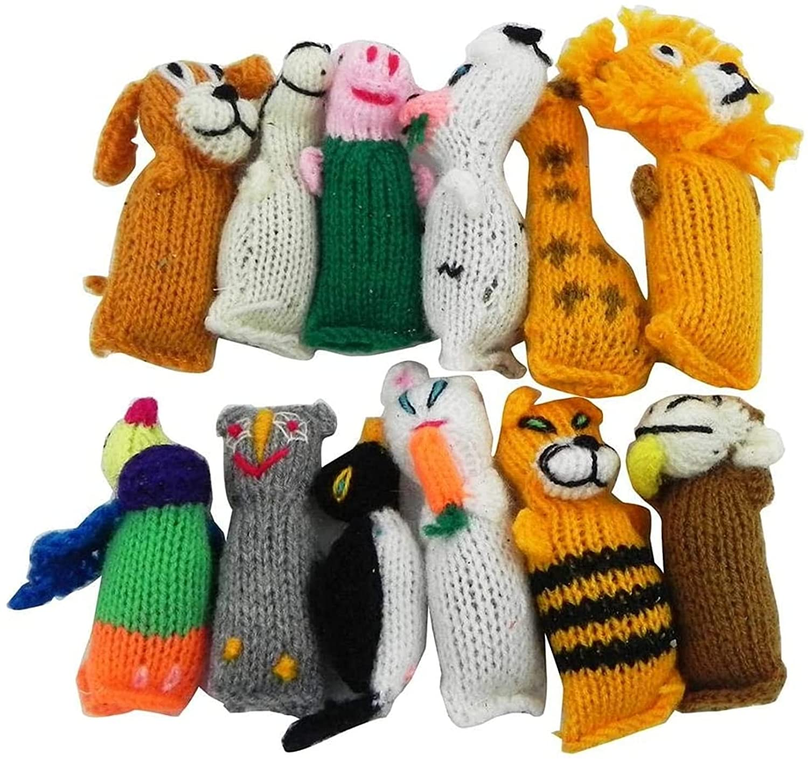
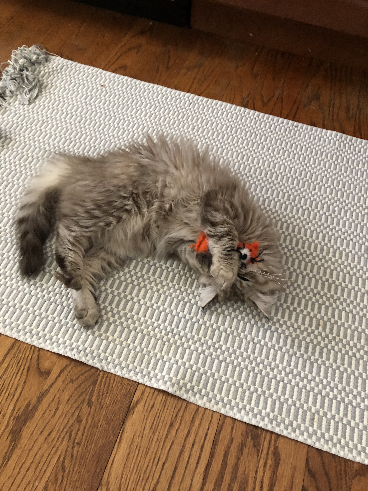

```{r xaringan-themer, include = FALSE}
library(xaringanthemer)
mono_accent(base_color = "#5E5E5E") #3E8A83?
options(htmltools.preserve.raw = FALSE)
```

```{r xaringan-panelset, echo=FALSE}
xaringanExtra::use_panelset()
```

```{r, echo = FALSE}
knitr::opts_chunk$set(
  message = FALSE, warning = FALSE
)
```

```{r, include = FALSE}
library(tidyverse)
library(mosaic)
library(gt)
```

<!--
pagedown::chrome_print("~/Dropbox/Teaching/03-Simmons Courses/STAT338-Probability Theory/Slides/05-Multivariate_Distributions/05-Multivariate_Distributions.html")
-->

class: center, middle, frame

# Joint Distributions

---

# Multiple Random Variables

So far, we have looked at a **single random variable**, *Y*. 

- The distribution of *Y* provides *complete information* about **probabilities** associated with *Y*. 

But in many applications, we care about the relationship between **multiple random variables** in the same experiment!

<br>

**Joint/Multivariate distributions** allow us to learn about how multiple random variables are related, by studying the probability distribution associated with the *intersection* of multiple random variables: $$(Y_{1}=y_{1}),(Y_{2}=y_{2}),\dots,(Y_{n}=y_{n})$$

---

# Extending to Multivariate Distributions

.pull-left[
- $Y\sim\text{Normal}(100, 15)$

```{r, echo = FALSE, fig.width = 3, fig.height = 3.5, dpi = 300}
set.seed(338)
normal_samp = rnorm(n = 10000, mean = 100, sd = 15)
gf_density( ~ normal_samp, binwidth = 0.5) + 
  labs(x = "y", y = "f(y)") + 
  theme_bw()
```
]

.pull-right[
- $\binom{X}{Y}\sim\text{Multivariate Normal}$

```{r, echo = FALSE, fig.width = 3, fig.height = 3.5, dpi = 300}
data = data.frame(
  x = rnorm(10000, 100, 15), 
  y = rnorm(10000, 100, 15)
)

ggplot(data, aes(x=x, y=y) ) +
  stat_density_2d(aes(fill = ..level..), geom = "polygon", color = "white") + 
  labs(x = "X", y = "Y", fill = "f(x,y)") +
  theme_bw()
```
]

---

# Discrete Joint Distributions

**Example**

Suppose we make our way back to *Piéchart Casino* and play a game where we toss three *balanced* coins *independently* (no, this game isn't rigged):

- $X=$ number of heads

- $Y=\dots$
    - &#36;1 if first head is on toss 1
    - &#36;2 if first head is on toss 2
    - &#36;3 if first head is on toss 3
    - -&#36;1 if no heads
    
--

**Outcomes**

```{r, echo = FALSE}
data.frame(Outcome = c("X", "Y"), HHH = c(3,1), THH = c(2,2), HTH = c(2,1), HHT = c(2,1), 
           TTH = c(1,3), THT = c(1,2), HTT = c(1,1), TTT = c(0,-1)) %>%
  gt() 
```

---

# Joint PMF

Let $X$ and $Y$ be **discrete** random variables. The **joint (bivariate) probability function** for $X$ and $Y$ is given by $$p(x,y)=P(X=x,Y=y).$$

--

```{r, echo = FALSE}
data.frame(Outcome = c("X", "Y"), HHH = c(3,1), THH = c(2,2), HTH = c(2,1), HHT = c(2,1), 
           TTH = c(1,3), THT = c(1,2), HTT = c(1,1), TTT = c(0,-1)) %>%
  gt() 
```

In the *Piéchart Casino* example, a visual of the joint PMF is given below:

.center[
```{r, echo = FALSE, fig.width = 3, fig.height = 2, dpi = 300, out.width = "50%"}
mult_dist = replicate(10000, {
  coin_toss = sample(0:1, size = 3, replace = TRUE)
  Y1 = sum(coin_toss)
  
  first_head = which(coin_toss == 1)[1]
  Y2 = case_when(
    first_head == 1 ~ 1,
    first_head == 2 ~ 2,
    first_head == 3 ~ 3,
    is.na(first_head) ~ -1
  )
  c(Y1, Y2)
}, simplify = FALSE)

mult_dist = do.call(rbind.data.frame, mult_dist)
names(mult_dist) = c("X", "Y")

ggplot(mult_dist, aes(x = X, y = Y) ) +
  geom_bin2d() +
  scale_fill_continuous(type = "viridis", 
                        label = scales::percent_format(scale = 0.0001, suffix = "")) +
  labs(fill = "P(X=x, Y=y)") +
  theme_bw()
```

]

---

# Joint PMF

Similar to the single variable (**univariate**) case, a *valid* PMF must be nonnegative and sum to 1. 

**Theorem**: If $X$ and $Y$ are discrete random variables with joint probability function $p(x,y)$, then...

1. $p(x,y)\geq 0$ for all $x,y$. 

2. $\sum_{x,y}p(x,y)=1$, where the sum is over all values $(x,y)$ that are assigned non-zero probabilities.

<br>

🤔 Is our PMF from the *Piéchart Casino* example a *valid* PMF?

---

# Joint Distribution Function

For any random variables $X$ and $Y$, the **joint (bivariate) distribution function**, $F(x,y)$, is $$F(x,y)=P(X\leq x, Y\leq y),\qquad -\infty<x<\infty,\ -\infty<y<\infty.$$

<br>

**Practice**

In the *Piéchart Casino* example, find $F(2,1)=P(X\leq2,Y\leq1)$.

```{r, echo = FALSE}
data.frame(Outcome = c("X", "Y"), HHH = c(3,1), THH = c(2,2), HTH = c(2,1), HHT = c(2,1), 
           TTH = c(1,3), THT = c(1,2), HTT = c(1,1), TTT = c(0,-1)) %>%
  gt() 
```

---

# Joint Distribution Function

For any random variables $X$ and $Y$, the **joint (bivariate) distribution function**, $F(x,y)$, is $$F(x,y)=P(X\leq x, Y\leq y),\qquad -\infty<x<\infty,\ -\infty<y<\infty.$$

<br>

**Solution**

In the *Piéchart Casino* example, find $F(2,1)=P(X\leq2,Y\leq1)$.

```{r, echo = FALSE}
data.frame(Outcome = c("X", "Y"), HHH = c(3,1), THH = c(2,2), HTH = c(2,1), HHT = c(2,1), 
           TTH = c(1,3), THT = c(1,2), HTT = c(1,1), TTT = c(0,-1)) %>%
  gt() %>%
  tab_style(
    style = list(
      cell_text(color = "black", weight = "bold"), 
      cell_fill(color = "dodgerblue", alpha = 0.2)
      ),
    locations = cells_body(
      columns = vars(HTH, HHT, HTT, TTT)) 
  )
```

\begin{align*}
P(X\leq2,Y\leq1)&=P(X=0,Y=-1)+P(X=1,Y=1)+P(X=2,Y=1)\\
&=\frac{1}{8}+\frac{1}{8}+\frac{2}{8}\\
&=\frac{1}{2}
\end{align*}

---

# Continuous Joint Distributions

Let $X$ and $Y$ be **continuous** random variables with joint distribution function $F(x,y)$. If there exists a nonnegative function $f(x,y)$, such that $$F(x,y)=P(X\leq x, Y\leq y)=\int^{x}_{-\infty}\int^{y}_{-\infty}f(t_{1},t_{2})\,dt_{2}dt_{1},$$ for all $-\infty<x<\infty$, $-\infty<y<\infty$, then $X$ and $Y$ are **jointly continuous random variables**. 

- The function $f(x,y)$ is called the **joint probability density function (PDF)**. 

--

Similar to joint discrete random variables, if $X$ and $Y$ are jointly continuous, then...

1. $f(x,y)\geq0$ for all $x,y$. 

2. $\int_{-\infty}^{\infty}\int_{-\infty}^{\infty}f(x,y)\,dxdy=1$

---

# Continuous Joint Probabilities

Let $X$ and $Y$ be **continuous** random variables with joint distribution function $F(x,y)$. If there exists a nonnegative function $f(x,y)$, such that $$F(x,y)=P(X\leq x, Y\leq y)=\int^{x}_{-\infty}\int^{y}_{-\infty}f(t_{1},t_{2})\,dt_{2}dt_{1},$$ for all $-\infty<x<\infty$, $-\infty<y<\infty$, then $X$ and $Y$ are **jointly continuous random variables**. 

- The function $f(x,y)$ is called the **joint probability density function (PDF)**. 

For two RVs $X$ and $Y$ with joint PDF $f(x,y)$, the *joint probability* $P(a_{1}\leq X\leq a_{2}, b_{1}\leq Y\leq b_{2})$ is $$P(a_{1}\leq X\leq a_{2}, b_{1}\leq Y\leq b_{2})=\int_{b_{1}}^{b_{2}}\int_{a_{1}}^{a_{2}}f(x,y)\,dxdy$$

---

# Continuous Joint Distributions 

**Example**

Let $X$ and $Y$ be random variables with joint probability density function $$f(x,y)=\begin{cases}x+y,&0<x<1,0<y<1\\0,&\text{elsewhere}.\end{cases}$$

- Find $P(X>0.5, Y<0.5)$. 

.center[
```{r, echo = FALSE, fig.width = 3, fig.height = 2, dpi = 300, out.width = "50%"}
set.seed(228)
data = data.frame(x = runif(50000, 0, 1), 
                  y = runif(50000, 0, 1))

pdf = function(x, y){
  x + y
}
probs = pdf(data$x, data$y)
indices = sample(1:50000, size = 50000, replace = TRUE, prob = probs)
data = data[indices, ]

ggplot(data, aes(x=x, y=y) ) +
  stat_density_2d(aes(fill = ..level..), geom = "polygon", color = "white") + 
  scale_fill_continuous(type = "viridis") +
  labs(x = "x", y = "y", fill = "f(x,y)") +
  theme_bw()

#mean(data$x > 1/2)
```
]

---

# Continuous Joint Distributions 

**Example** (WMS 5.7)

Let $Y_{1}$ and $Y_{2}$ have the joint probability density function $$f(y_{1},y_{2})=\begin{cases}e^{-(y_{1}+y_{2})},&y_{1}>0,y_{2}>0\\0,&\text{elsewhere}.\end{cases}$$

1. Show that $P(Y_{1}+Y_{2}<3)=1-4e^{-3}=0.8009$. 

2. Find $P(Y_{1}<1, Y_{2}>5)$.

.center[
```{r, echo = FALSE, fig.width = 3, fig.height = 2, dpi = 300, out.width = "50%"}
data = data.frame(y1 = runif(50000, 0.0, 7), 
                  y2 = runif(50000, 0.0, 7))
pdf_5_7 = function(y1, y2){
  dexp(y1) * dexp(y2)
}
indices = sample(1:50000, size = 10000, replace = TRUE, prob = pdf_5_7(data$y1, data$y2))
data = data[indices, ]

#ggplot(data, aes(y1, y2)) + 
#  geom_density_2d()

ggplot(data, aes(x=y1, y=y2) ) +
  stat_density_2d(aes(fill = ..level..), geom = "polygon", color = "white") + 
  scale_fill_continuous(type = "viridis") +
  labs(x = "Y1", y = "Y2", fill = "f(y1,y2)") +
  theme_bw()
```
]

---

class: center, middle, frame

# Marginal Distributions

---

# Piéchart Casino

Recall the *Piéchart Casino* from earlier. 

- $X=$ number of heads

- $Y=\dots$
    - &#36;1 if first head is on toss 1
    - &#36;2 if first head is on toss 2
    - &#36;3 if first head is on toss 3
    - -&#36;1 if no heads

**Outcomes**

```{r, echo = FALSE}
data.frame(Outcome = c("X", "Y"), HHH = c(3,1), THH = c(2,2), HTH = c(2,1), HHT = c(2,1), 
           TTH = c(1,3), THT = c(1,2), HTT = c(1,1), TTT = c(0,-1)) %>%
  gt() 
```

--

What if we only wanted to find a probability *associated with X*, such as $P(X = 2)$?

- To find the distribution of *X* **alone**, we need to sum over *all possible values of Y*: $P(X=2)=p(2,-1)+p(2,1)+p(2,2)+p(2,3)$

---

# Marginal Probability Functions (Discrete)

We just found a *marginal probability*! 

For **discrete** random variables $X$ and $Y$, the **marginal probability function** of $X$ is $$P(X=x)=\sum_{y}P(X=x,Y=y).$$ 

.pull-left[
```{r, echo = FALSE, fig.width = 3, fig.height = 2.7, dpi = 300}
ggplot(mult_dist, aes(x = X, y = Y) ) +
  geom_bin2d() +
  scale_fill_continuous(type = "viridis", 
                        label = scales::percent_format(scale = 0.0001, suffix = "")) +
  labs(x = "x", y = "y", fill = "P(X=x, Y=y)", title = "Joint Distribution of X and Y") +
  theme_bw()
```
]

.pull-right[
```{r, echo = FALSE, fig.width = 3, fig.height = 2.7, dpi = 300}
ggplot(mult_dist, aes(x = X) ) +
  geom_histogram() +
  labs(x = "x", y = "P(X=x)", title = "Marginal Distribution of X") + 
  scale_y_continuous(labels = scales::percent_format(accuracy = 0.01, scale = 0.0001, suffix = "")) +
  theme_bw()
```
]

---

# Marginal Probability Functions (Continuous)

For **continuous** random variables $X$ and $Y$, the **marginal probability functions** of $X$ and $Y$, respectively, are $$f_{X}(x)=\int_{-\infty}^{\infty}f(x,y)\,dy\qquad\text{and}\qquad f_{Y}(y)=\int_{-\infty}^{\infty}f(x,y)\,dx.$$ 

.pull-left[
```{r, echo = FALSE, fig.width = 3, fig.height = 3, dpi = 300}
set.seed(228)
data = data.frame(x = runif(50000, 0, 1), 
                  y = runif(50000, 0, 1))

pdf = function(x, y){
  x + y
}
probs = pdf(data$x, data$y)
indices = sample(1:50000, size = 50000, replace = TRUE, prob = probs)
data = data[indices, ]

ggplot(data, aes(x=x, y=y) ) +
  stat_density_2d(aes(fill = ..level..), geom = "polygon", color = "white") + 
  scale_fill_continuous(type = "viridis") +
  labs(x = "x", y = "y", fill = "f(x,y)", title = "Joint Distribution of X and Y") +
  theme_bw()

#mean(data$x > 1/2)
```
]

.pull-right[
```{r, echo = FALSE, fig.width = 3, fig.height = 3, dpi = 300}
ggplot(data, aes(x=x)) +
  geom_density(fill = "grey") +
  labs(x = "x", y = "f(x)", title = "Marginal Distribution of X") +
  theme_bw()
```

]

---

# Practice

Let $X$ and $Y$ be random variables with joint probability density function $$f(x,y)=\begin{cases}x+y,&0<x<1,0<y<1\\0,&\text{elsewhere}.\end{cases}$$

- Find the marginal distribution for $X$, $f_{X}(x)$. 

---

# Marginal Probability Functions (Continuous)

**Example**

Let $X$ and $Y$ be random variables with joint probability density function $$f(x,y)=\begin{cases}\frac{e^{-y}}{\sqrt{2\pi}}e^{-x^2/2},&-\infty<x<\infty,y>0\\0,&\text{elsewhere}.\end{cases}$$

- Find the marginal distributions $f_{X}(x)$ and $f_{Y}(y)$. 

--

<br>

**Solution**

It turns out...

- $X\sim\text{Normal}(0,1)$

- $Y\sim\text{Exponential}(1)$

---

class: center, middle, frame

# Conditional Distributions

---

# Condtional Probability

Suppose we have two random variables, $X$ and $Y$. We *observe* some value of $X$, and we want to use this to *update* our distribution of $Y$ to reflect this information. 

- The **marginal distributions**, $P(Y=y)$ and $f_{Y}(y)$, do not take into account *any* information about $X$. 

<br>

--

**Recall** some properties of **conditional probabilities** that we studied previously:

- $P(A\mid B)=\frac{P(A\cap B)}{P(B)}$

- $P(A\cap B)=P(A)P(B\mid A)=P(B)P(A\mid B)$

- $P(A\mid B)=\frac{P(B\mid A)P(A)}{P(B)}$ (**Bayes' Rule**)

---

# Conditional Distributions

We can extend the properties of **conditional probability** to settings involving random variables!

**Discrete case**

If $X$ and $Y$ are jointly **discrete** random variables with *joint* probability function $p(x,y)$ and *marginal* probability functions $p_X(x)$ and $p_{Y}(y)$, respectively, then the **conditional probability function** of $X$ *given* $Y=y$ is: $$p(x\mid y)=P(X=x\mid Y=y)=\frac{P(X=x, Y=y)}{P(Y=y)}=\frac{p(x,y)}{p_{Y}(y)}$$

--

**Continuous case**

For **continuous** random variables $X$ and $Y$ with *joint* density function $f(x,y)$ and *marginal* density functions $f_{X}(x)$ and $f_{Y}(y)$, the **conditional density function** of $X$ *given* $Y=y$ is: $$f(x\mid y)=\frac{f(x,y)}{f_{Y}(y)}$$


---

# Practice

(WMS 5.25)

Let $Y_{1}$ and $Y_{2}$ have the joint probability density function $$f(y_{1},y_{2})=\begin{cases}e^{-(y_{1}+y_{2})},&y_{1}>0,y_{2}>0\\0,&\text{elsewhere}.\end{cases}$$

1. Find the marginal density function for $Y_{2}$, $f_{Y_{2}}(y_{2})$. 

2. For $y_{2}>0$, what is the conditional density function of $Y_{1}$ given that $Y_{2}=y_{2}$?

---

# Conditional Distributions (Continuous)

**Example** (WMS 5.31)

Let $Y_{1}$ and $Y_{2}$ have the joint probability density function $$f(y_{1},y_{2})=\begin{cases}30y_{1}y_{2}^{2},&y_{1}-1\leq y_{2}\leq 1-y_{1}, 0\leq y_{1}\leq 1\\0,&\text{elsewhere}.\end{cases}$$

1. Show that the marginal density of $Y_{1}$ is a beta density with $\alpha=2$ and $\beta=4$. 

2. Find the conditional density of $Y_{2}$ given $Y_{1}=y_{1}$. Use this to show that $P(Y_{2}>0\mid Y_{1}=0.75)=0.5$. 

---

```{r, echo = FALSE, eval = FALSE}


# The Beta-Binomial Conjugacy

**The story**

Suppose we are tossing a **biased coin**, but we don't know *how* biased it is. 

- In other words, it lands Heads with some *unknown* probability, $p$.

- We could *infer* the value of $p$ by tossing the coin a bunch of times. But that isn't **fun**...

--

**The Set-up**

Let's assign the $Beta(\alpha,\beta)$ distribution to the *unknown* $p$. 

- That is, $p\sim\text{Beta}(\alpha,\beta)$. 

Let $Y$ be the number of Heads in $n$ tosses of the coin. 

- This **depends on** $p$, so we would write: $$Y\mid p\sim\text{Binomial}(n,p)$$

---

# The Beta-Binomial Conjugacy

To update the **prior distribution** of $p$ based on our "data" (*Y*), we use Bayes' Rule: $$f(p\mid Y=y)=\frac{P(Y=y\mid p)f(p)}{P(Y=y)}$$

--

We can write $P(Y=y\mid p)$ and $f(p)$ just by using the *Binomial* and *Beta* probability functions, but $P(Y=y)$ is a **marginal** probability function. 

- Using the $P(A\cap B)=P(A\mid B)P(B)$ property, we can calculate $$P(Y=y)=\int_{0}^{1}P(Y,p)\,dp=\int_{0}^{1}P(Y\mid p)f(p)\,dp.$$

---
```

class: center, middle, frame

# Independent Random Variables

---

# Independent Events

Two events are said to be **independent** if knowledge that one event occurs does not indicate whether the other event is more likely to occur. 

Formally, two events are **independent** if *any* one of the following holds:

- $P(A\mid B)=P(A)$

- $P(B\mid A)=P(B)$

- $P(A\cap B)=P(A)P(B)$

Otherwise, the events are said to be *dependent*. 

--

This was from the first month of class, but we can extend it to a setting involving *random variables*. 

- In fact, we've already seen joint distributions where...
    - the probabilities associated with $X$ depended on the observed value of $Y$
    - the probabilities associated with $X$ are completely independent of $Y$
    
---

# Independent Random Variables

The *technical* definition of **independence** involves *cumulative distribution functions*...

Let $X$ have distribution function $F_{X}(x)$, $Y$ have distribution function $F_{Y}(y)$, and $X$ and $Y$ have *joint* distribution function $F(x,y)$. Then $X$ and $Y$ are said to be **independent** if and only if $$F(x,y)=F_{X}(x)F_{Y}(y)=P(X\leq x)P(Y\leq y).$$ If $X$ and $Y$ are not independent, they are said to be **dependent**. 

--

<br>

This is equivalent to the following, involving *probability functions*:

- **Discrete RVs**: Independence $\iff$ $p(x,y)=p_{X}(x)p_{Y}(y)$

- **Continuous RVs**: Independence $\iff$ $f(x,y)=f_{X}(x)f_{Y}(y)$

---

# Independence in 2x2 Tables

[Are SSRIs associated with increased risk of bone fractures among the elderly?](https://www.mcgill.ca/channels/news/new-muhc-study-shows-increased-risk-bone-fracture-elderly-people-daily-medication-depression-23574)

- $n=5008$ adults over the age of 50, followed for five years

**Study Results**

.center[
```{r, echo = FALSE}
ssri_data = data.frame(taking_ssri = c(14, 123, 137), no_ssri = c(244, 4627, 4871), total = c(258, 4750, 5008))
names(ssri_data) = c("Taking SSRI", "No SSRI", "Total")
row.names(ssri_data) = c("Experiences Fractures", "No Fractures", "Total")
knitr::kable(ssri_data, format = "html", row.names = TRUE)
```
]

--

For each study participant, we can understand the events "*Taking SSRI*" and "*Experiences Fractures*" (and their counterparts) as results of **Bernoulli trials**. 

- We can find *joint*, *marginal*, and *conditional* distributions using the 2x2 table!

---

# Independence in 2x2 Tables

[Are SSRIs associated with increased risk of bone fractures among the elderly?](https://www.mcgill.ca/channels/news/new-muhc-study-shows-increased-risk-bone-fracture-elderly-people-daily-medication-depression-23574)

- $n=5008$ adults over the age of 50, followed for five years

**Study Results**

.center[
```{r, echo = FALSE}
ssri_data = data.frame(taking_ssri = c(14, 123, 137), no_ssri = c(244, 4627, 4871), total = c(258, 4750, 5008))
names(ssri_data) = c("Y = 1", "Y = 0", "Total")
row.names(ssri_data) = c("X = 1", "X = 0", "Total")
knitr::kable(ssri_data, format = "html", row.names = TRUE)
```
]

<br>

> Are *X* and *Y* independent?

---

# Practice 

(WMS 5.53)

Let $Y_{1}$ and $Y_{2}$ have the joint probability density function $$f(y_{1},y_{2})=\begin{cases}6(1-y_{2}),&0\leq y_{1}\leq y_{2}\leq1\\0,&\text{elsewhere}.\end{cases}$$

- By finding $f_{1}(y_{1})$ and $f_{2}(y_{2})$, show that $Y_{1}$ and $Y_{2}$ are **dependent**. 

--

**Solution**:

- $f_{1}(y_{1})=3-6y_{1}+3y_{1}^{2},\ 0\leq y_{1}\leq 1$

- $f_{2}(y_{2})=6y_{2}(1-y_{2}),\ 0\leq y_{2}\leq 1$

Therefore, $f(y_{1},y_{2})\neq f_{1}(y_{1})f_{2}(y_{2})$. 

---

# One Simple Trick ™️

**Theorem**: Let $Y_{1}$ and $Y_{2}$ have a joint density $f(y_{1},y_{2})$ that is positive if and only if $a\leq y_{1}\leq b$ and $c\leq y_{2} \leq d$, for constants $a$, $b$, $c$, and $d$. Then $Y_{1}$ and $Y_{2}$ are independent if and only if $$f(y_{1},y_{2})=g(y_{1})h(y_{2}),$$ where $g(y_{1})$ is a nonnegative function of $y_{1}$ *alone* and $h(y_{2})$ is a nonnegative function of $y_{2}$ *alone*. 

- In some cases, we don't need to derive marginal densities to prove independence! We just need to break the joint density function into separate pieces involving $y_{1}$ and $y_{2}$ alone. 

---

# Example

Suppose $Y_{1}$ and $Y_{2}$ denote the lengths of life, in hundreds of hours, for components of types I and II, respectively, in an electronic system. The joint density of $Y_{1}$ and $Y_{2}$ is $$f(y_{1},y_{2})=\begin{cases}(1/8)y_{1}e^{-(y_{1}+y_{2})/2},& y_{1}>0, y_{2}>0,\\0,&\text{elsewhere}.\end{cases}$$

- Using the previous theorem, prove that $Y_{1}$ and $Y_{2}$ are independent. 

--

**Solution**: $f(y_{1},y_{2})=g(y_{1})h(y_{2})$, where...

- $g(y_{1})=(1/8)y_{1}e^{-y_{1}/2}$

- $h(y_{2})=e^{-y_{2}/2}$


---

class: center, middle, frame

# The Expected Value of a Function of Random Variables

## Multivariate LOTUS

---

# Multivariate LOTUS

**Discrete**

Let $g(Y_{1},Y_{2},\dots,Y_{k})$ be a function of discrete RVs with joint probability function $p(y_{1},y_{2},\dots,y_{k})$. Then the **expected value** of $g(Y_{1},Y_{2},\dots,Y_{k})$ is $$E[g(Y_{1},Y_{2},\dots,Y_{k})]=\sum_{y_{k}}\cdots\sum_{y_{2}}\sum_{y_{1}}g(y_{1},y_{2},\dots,y_{k})p(y_{1},y_{2},\dots,y_{k}).$$

<br>

**Continuous**

If $Y_{1},Y_{2},\dots,Y_{k}$ are continuous RVs with joint density function $f(y_{1},y_{2},\dots,y_{k})$, then $$E[g(Y_{1},Y_{2},\dots,Y_{k})]=\int_{-\infty}^{\infty}\cdots\int_{-\infty}^{\infty}\int_{-\infty}^{\infty}g(y_{1},y_{2},\dots,y_{k})f(y_{1},y_{2},\dots,y_{k})\,dy_{1}dy_{2}\dots dy_{k}.$$

---

# Multivariate LOTUS

**Example** 

Certain electrical fuses operate *independently* with lifetimes $Y_{i}\sim\text{Exp}(\beta=3)$, $i=1,2$. In other words, $$f(y_{1},y_{2})=\begin{cases}\left(\frac{1}{3}e^{-y_{1}/3}\right)\left(\frac{1}{3}e^{-y_{2}/3}\right),&y_{1}>0,y_{2}>0\\0,&\text{elsewhere}.\end{cases}$$

Find $E(Y_{1}+Y_{2})$ and $E(Y_{1}Y_{2})$. 

---

# Two Simple Tricks ™️

**Theorems**

1. Let $Y_{1}$ and $Y_{2}$ be random variables and $g_{1}(Y_{1},Y_{2}),g_{2}(Y_{1},Y_{2}),\dots,g_{k}(Y_{1},Y_{2})$ be functions of $Y_{1}$ and $Y_{2}$. Then 
\begin{align*}
& E[g_{1}(Y_{1},Y_{2})+g_{2}(Y_{1},Y_{2})+\cdots+g_{k}(Y_{1},Y_{2})]\\
&\ \ \ \ =E[g_{1}(Y_{1},Y_{2})]+E[g_{2}(Y_{1},Y_{2})]+\cdots+E[g_{k}(Y_{1},Y_{2})]
\end{align*}

2. Let $Y_{1}$ and $Y_{2}$ be **independent** random variables and $g(Y_{1})$ and $h(Y_{2})$ be functions of *only* $Y_{1}$ and $Y_{2}$, respectively. Then $$E[g(Y_{1})h(Y_{2})]=E[g(Y_{1})]E[h(Y_{2})],$$ provided that the expectations exist. 

---

# Practice

(WMS 5.81)

Suppose $Y_{1}$ and $Y_{2}$ denote the lengths of life, in hundreds of hours, for components of types I and II, respectively, in an electronic system. The joint density of $Y_{1}$ and $Y_{2}$ is $$f(y_{1},y_{2})=\begin{cases}(1/8)y_{1}e^{-(y_{1}+y_{2})/2},& y_{1}>0, y_{2}>0,\\0,&\text{elsewhere}.\end{cases}$$

One way to measure the relative efficiency of the two components is to compute the ratio $Y_{2}/Y_{1}$. Find $E(Y_{2}/Y_{1})$. 

- **Hint**: Use the fact that $Y_{1}$ and $Y_{2}$ are *independent*. The *Gamma* and *Exponential* PDFs will also help!

---

class: center, middle, frame

# Covariance and Correlation

```{r, echo = FALSE, eval = FALSE}
y1 = runif(50000, 0, 20)
y2 = runif(50000, 0, 20)
pdf_ex = function(y1, y2){
  dexp(y1, rate = 1/3) * dexp(y2, rate = 1/3)
}
probs = pdf_ex(y1, y2)
indices = sample(1:50000, size = 10000, replace = TRUE, prob = probs)

y1 = y1[indices]
y2 = y2[indices]

mean(y1 + y2)
mean(y1*y2)

##########

y1 = runif(50000, 0, 20)
y2 = runif(50000, 0, 20)
pdf_ex = function(y1, y2){
  (1/8)*y1*exp(-(y1+y2)/2)
}
probs = pdf_ex(y1, y2)
indices = sample(1:50000, size = 10000, replace = TRUE, prob = probs)

y1 = y1[indices]
y2 = y2[indices]

mean(y2/y1)
```

---

# Dependent Random Variables

.center[
```{r, echo = FALSE, fig.width = 3.5, fig.height = 3, dpi = 300, out.width = "45%"}
set.seed(228)
tibble(x = rnorm(1000), 
       y = 2*x + 5 + rnorm(1000, sd = 0.25)) %>%
  slice_sample(n = 20) %>%
  ggplot(aes(x, y)) + 
  geom_point(size = 2.5) + 
  #geom_smooth() + 
  theme_minimal()
```
]

- $E(X)=\mu_{X}=0.0818$

- $E(Y)=\mu_{Y}=5.3403$

---

# Dependent Random Variables

.center[
```{r, echo = FALSE, fig.width = 3.5, fig.height = 3, dpi = 300, out.width = "45%"}
# Mean X: 0.0817795
# Mean Y: 5.870626
set.seed(228)
tibble(x = rnorm(1000), 
       y = 2*x + 5 + rnorm(1000, sd = 0.25)) %>%
  slice_sample(n = 20) %>%
  ggplot(aes(x, y)) + 
  geom_point(size = 2.5) + 
  geom_point(data = tibble(x = 0.0817795, y = 5.340326), 
             aes(x, y), size = 4, color = "#C66286") +
  annotate(geom = "segment", x = 0.0817795, xend = 0.0817795,
           y = 0, yend = 5.340326, color = "#C66286", size = 1, linetype = "dashed") +
  annotate(geom = "segment", x = 0, xend = -2,
           y = 5.340326, yend = 5.340326, color = "#C66286", size = 1, linetype = "dashed") +
  theme_minimal()
```
]

Because $X$ and $Y$ tend to move in the same direction...

- $X-E(X)$ and $Y-E(Y)$ with *both* be either **positive** or **negative**

--

This implies that the **covariance** between $X$ and $Y$ will be positive!

---

# Independent Random Variables

.center[
```{r, echo = FALSE, fig.width = 3.5, fig.height = 3, dpi = 300, out.width = "45%"}
set.seed(228)
tibble(x = rnorm(1000), 
       y = rnorm(1000)) %>%
  slice_sample(n = 100) %>%
  ggplot(aes(x, y)) + 
  geom_point(size = 2.5) + 
  theme_minimal()
```
]

- $E(X)=\mu_{X}=-0.0309$

- $E(Y)=\mu_{Y}=0.0188$

---

# Independent Random Variables

.center[
```{r, echo = FALSE, fig.width = 3.5, fig.height = 3, dpi = 300, out.width = "45%"}
set.seed(228)
tibble(x = rnorm(1000), 
       y = rnorm(1000)) %>%
  slice_sample(n = 100) %>%
  ggplot(aes(x, y)) + 
  geom_point(size = 2.5, alpha = 0.5) + 
  geom_point(data = tibble(x = -0.03090506, y = 0.01884312), 
             aes(x, y), size = 5, color = "#C66286") +
  annotate(geom = "segment", x = -0.03090506, xend = -0.03090506,
           y = -3, yend = 0.01884312, color = "#C66286", size = 1, linetype = "dashed") +
  annotate(geom = "segment", x = 0, xend = -3,
           y = 0.01884312, yend = 0.01884312, color = "#C66286", size = 1, linetype = "dashed") +
  theme_minimal()
```
]

Because $X$ and $Y$ don't really have any relationship in *either* direction...

- $X-E(X)$ and $Y-E(Y)$ with have the **same** sign for some points, and the **opposite** sign for others
    - This means that $(X-E(X))(Y-E(Y))$ will average to (approx.) zero. 

--

This implies that the **covariance** between $X$ and $Y$ will be near zero!

---

# Covariance

If $X$ and $Y$ are random variables with means $\mu_{X}$ and $\mu_{Y}$, respectively, the **covariance** of $X$ and $Y$ is $$Cov(X,Y)=E[(X-\mu_{X})(Y-\mu_{Y})]=E(XY)-E(X)E(Y).$$

--

<br>

We sometimes use the *standardized form* of the covariance, called the **correlation coefficient**: $$\rho=\frac{Cov(X,Y)}{\sigma_{X}\sigma_{Y}},$$ where $\sigma_{X}$ and $\sigma_{Y}$ are the *standard deviations* of $X$ and $Y$. 

- $\rho$ ranges between -1 and +1
    - $\rho=1$ implies a *perfect positive (linear) correlation*
    - $\rho=-1$ implies a *perfect negative (linear) correlation*

---

# Practice

Suppose that $Y_{1}$ and $Y_{2}$ are jointly continuous with PDF given by $$f(y_{1},y_{2})=\begin{cases}4y_{1}y_{2},&0\leq y_{1}\leq 1,0\leq y_{2}\leq 1,\\0,&\text{elsewhere.}\end{cases}$$

Find $Cov(Y_{1},Y_{2})$. 

> Is this result surprising? Why or why not?

---

# Covariance and Independence

**Theorem**

If $X$ and $Y$ are **independent** random variables, then $$Cov(X,Y)=0.$$ Thus, the variables must be *uncorrelated*.

--

🚨🚨The *converse* is not true!!!🚨🚨

- If $Cov(X,Y)=0$, then $X$ and $Y$ are *not necessarily* independent!

--

**Example**

Let $X\sim\text{Normal}(0, 1)$ and $Y=X^{2}$. Prove that $Cov(X,Y)=0$ but $X$ and $Y$ are **not** independent. 

- We'll use the fact that $\text{Skew}(X)=0$ for a $\text{Normal}(0,1)$ distribution. 

---

# Covariance in R

Let's simulate $X$ and $Y$ from the previous example!

```{r}
X = rnorm(10000)
Y = X^2
data = data.frame(X, Y)
```

Using the `cov()` function on a *data frame* will produce a **covariance matrix**:

```{r}
cov(data)
```

--

*Clearly* not independent!

.center[
```{r, echo = FALSE, fig.width = 3, fig.height = 2, dpi = 300, out.width = "30%"}
gf_point(Y ~ X, data = data) + 
  theme_bw()
```
]

---

class: center, middle, frame

# The Expected Value and Variance of Linear Functions of Random Variables

---

# Coupon Collector's Problem

Moose's **favorite** toys are pictured below. 

.pull-left[
- Suppose there are **12** types of toys, which you collect one by one, with the goal of getting a complete set. 

- When collecting toys, the toy types are **random** and *equally likely*.

> What is the expected number of toys I need to collect until Moose has a complete set?
]

.pull-right[

```{r, echo = FALSE, out.width = "50%"}

```
```{r, echo = FALSE, out.width = "75%"}

```
]

---

# Coupon Collector's Problem

.pull-left[
```{r, echo = FALSE, out.width = "75%"}

```
]

.pull-right[
In *this* problem that we worked through earlier in the semester, we let $$N=N_{1}+\cdots+N_{12}$$

- $N=$ number of toys needed until we get all 12

- $N_{i}=$ number of toys needed, starting from $N_{i-1}$, until we get $i$ toys

Then $$E(N)=E(N_{1})+\cdots+E(N_{12})$$

- **Note**: The $N_{i}$ are **independent** from one another!
]

---

# Linear Functions of Random Variables

For random variables $Y_{1},Y_{2},\dots,Y_{n}$ and constants $a_{1},a_{2},\dots,a_{n}$, a **linear function** of the $Y_{i}$ random variables is: $$U_{1}=a_{1}Y_{1}+a_{2}Y_{2}+\cdots+a_{n}Y_{n}=\sum_{i=1}^{n}a_{i}Y_{i}$$

- Many problems in *statistical inference* (see, 😎**STAT 339**😎) involve estimators that are linear functions of measurements in a sample. 

--

We might be interested in:

- The **expected value** and **variance** of $U_{1}$

- The **covariance** between $U_{1}$ and a second linear combination of RVs, $U_{2}$. 

---

# Linear RVs Theorem

Let $Y_{1}, Y_{2},\dots,Y_{n}$ and $X_{1},X_{2},\dots,X_{m}$ be random varibles with $E(Y_{i})=\mu_{i}$ and $E(X_{i})=\xi_{i}$. Define $$U_{1}=\sum_{i=1}^{n}a_{i}Y_{i}\quad\text{and}\quad U_{2}=\sum_{j=1}^{m}b_{j}X_{j}$$ for constants $a_{1},a_{2},\dots,a_{n}$ and $b_{1},b_{2},\dots,b_{m}$. Then:

1. $E(U_{1})=\sum_{i=1}^{n}a_{i}E(Y_{i})$

2. $Var(U_{1})=\sum_{i=1}^{n}a_{i}^{2}Var(Y_{i})+2\sum\sum_{1\leq i<j\leq n}a_{i}a_{j}Cov(Y_{i},Y_{j})$, where the double sum is over all pairs $(i,j)$ with $i<j$. 

3. $Cov(U_{1},U_{2})=\sum_{i=1}^{n}\sum_{j=1}^{m}a_{i}b_{j}Cov(Y_{i},X_{j})$

---

# Example

Let $Y_{1},Y_{2},\dots,Y_{n}$ be *independent* random variables with $E(Y_{i})=\mu$ and $Var(Y_{i})=\sigma^{2}$. Define the **sample mean** as $$\bar{Y}=\frac{1}{n}\sum_{i=1}^{n}Y_{i}.$$ Show that $E(\bar{Y})=\mu$ and $Var(\bar{Y})=\sigma^{2}/n$. 

- $\bar{Y}=\left(\frac{1}{n}\right)Y_{1}+\cdots+\left(\frac{1}{n}\right)Y_{n}$

---

# Correlated Normal RVs

Let's *simulate* correlated Normal random variables!

.pull-left[
```{r, warning = FALSE, message = FALSE}
library(faux)
fake_data = rnorm_multi(
  n = 10000, 
  mu = c(0, 20), 
  sd = c(1, 2), 
  r = 0.75
)
```

- $X_{1}\sim Normal$, $X_{2}\sim Normal$

- $E(X_{1})=0$, $Var(X_{1})=1$

- $E(X_{2})=20$, $Var(X_{2})=4$

- $Corr(X_{1},X_{2})=0.75\implies$
    - $Cov(X_{1},X_{2})=0.75\sqrt{1}\sqrt{4}=1.5$
]

.pull-right[
```{r, fig.width = 3, fig.height = 3, dpi = 300}
gf_point(X2 ~ X1, data = fake_data)
```
]

---

# Correlated Normal RVs

First, find $Var(X_{1}-X_{2})$ and $Var(X_{1}+X_{2})$ by hand. 

--

- $Var(X_{1}-X_{2})=Var(X_{1})+Var(X_{2})-2Cov(X_{1},X_{2}) = 2$

- $Var(X_{1}+X_{2})=Var(X_{1})+Var(X_{2})+2Cov(X_{1},X_{2}) = 8$

--

**Check**:

```{r}
var(fake_data$X1 - fake_data$X2)

var(fake_data$X1 + fake_data$X2)
```

---

# Hypergeometric Variance

Another one of Moose's **favorite** toys is pictured below. Her *favorite* color toy is red.

.pull-left[
If this box of size $N=r+b$ is filled with $r$ red toys and $b$ blue toys, and we draw $n$ toys **without replacement**, then the number of **red toys**, $Y$ follows a...

- $\text{HGeom}(N, r, n)$ distribution!

<br>

🤔Let's derive $Var(Y)$. 
]

.pull-right[
```{r, echo = FALSE}
knitr::include_graphics("cat_ball_toys.jpg")
```
]

---

# Hypergeometric Variance

First, represent $Y$ as a sum of **indicator variables**, $$Y=I_{1}+\cdots+I_{n},$$ where $I_{j}$ is the indicator of the $j$th toy in the sample being red ( $I_{j}=1$ if red, $I_{j}=0$ if blue). 

- For each $I_{j}$, $E(I_{j})=r/N$, which we'll define as $p$. 
    - Therefore, $Var(I_{j})=p(1-p)$ if we think of the $I_{j}$ as *Bernoulli* trials.

Therefore, 

\begin{align*}
Var(Y)&=Var\left(\sum_{j=1}^{n}I_{j}\right)\\
&=Var(I_{1})+\cdots+Var(I_{n})+2\sum_{i<j}Cov(I_{i},I_{j})\\
&=np(1-p)+2\binom{n}{2}Cov(I_{1},I_{2}),
\end{align*}

since there are $\binom{n}{2}$ combinations of $I_{i}$ and $I_{j}$, and the covariance between each of the pairs is the same. 

---

# Hypergeometric Variance

For $Cov(I_{1},I_{2})$, use the following:

\begin{align*}
Cov(I_{1},I_{2})&=E(I_{1}I_{2})-E(I_{1})E(I_{2})\\
&=P(\text{1st and 2nd toys are both red})-P(\text{1st toy red})P(\text{2nd toy red})\\
&=\left(\frac{r}{N}\right)\left(\frac{r-1}{N-1}\right)-p^{2}
\end{align*}

--

Plugging this in for $Cov(I_{1},I_{2})$, the variance simplifies to: $$Var(Y)=np(1-p)\left(\frac{N-n}{N-1}\right)$$

- The $\frac{N-n}{N-1}$ is known as a **finite population correction**, and adjusts the *binomial variance* for the fact that we are now sampling *without replacement*. 

---

class: center, middle, frame

# Conditional Expectation

## and Hierarchical Models
 
---

# Conditional Expectation

If $Y_{1}$ and $Y_{2}$ are any two random variables, the **conditional expectation** of $g(Y_{1})$, given that $Y_{2}=y_{2}$, is

- $E(g(Y_{1})\mid Y_{2}=y_{2})=\int_{-\infty}^{\infty}g(y_{1})f(y_{1}\mid y_{2})\,dy_{1}$ if $Y_{1}$ and $Y_{2}$ are **jointly continuous**. 

- $E(g(Y_{1})\mid Y_{2}=y_{2})=\sum_{y_{1}}g(y_{1})p(y_{1}\mid y_{2})$ if $Y_{1}$ and $Y_{2}$ are **jointly discrete**. 

--

**Laws of Total Expectation and Variance**

Let $Y_{1}$ and $Y_{2}$ denote random variables. Then:

1. $E(Y_{1})=E[E(Y_{1}\mid Y_{2})]$

2. $Var(Y_{1})=E[Var(Y_{1}\mid Y_{2})]+Var[E(Y_{1}\mid Y_{2})]$

---

# Beta-Binomial Hierarchy

Sometimes when working with the **binomial** distribution, we allow the *success probability*, $p$, to vary according to a **beta** distribution:

- $Y\mid P\sim Binomial(n, P)$

- $P\sim Beta(\alpha,\beta)$. 

--

<br>

Using the **Laws of Total Expectation and Variance**, 

- $E(Y)=E[E(Y\mid P)]=E(nP)=nE(P)=n\left(\frac{\alpha}{\alpha+\beta}\right)$

- $Var(Y)=n\left(\frac{\alpha\beta(\alpha+\beta+n)}{(\alpha+\beta)^{2}(\alpha+\beta+1)}\right)$
    - Let's show this...

---

# Binomial-Poisson Hierarchy

An insect lays a large number of eggs, each surviving with probability $p$. Let $X=$ the number of eggs that survived, and $Y=$ the number of eggs laid. 

Assuming that each egg's survival is independent from the next, we can treat them as *Bernoulli* trials with survival probability $p$, so the total number of survivors out of $Y$ eggs laid is **binomial**. 

- We model $Y$ with a $Poisson(\lambda)$ distribution to reflect the variability in eggs laid across litters from the same mother.

Assume the following hierarchy:

- $X\mid Y\sim Binomial(Y, p)$

- $Y\sim Poisson(\lambda)$

🤔 Find $E(X)$ and $Var(X)$. 

---

# Binomial-Poisson Hierarchy

Assume the following hierarchy:

- $X\mid Y\sim Binomial(Y, p)$

- $Y\sim Poisson(\lambda)$

```{r}
p = 0.75
lambda = 100

Y = rpois(10000, lambda = 100)
X = rbinom(10000, size = Y, prob = 0.75)

mean(X)
var(X)
```

---

# Binomial-Poisson-Exponential Hierarchy

What if instead we selected one mother insect from a large sample of mothers?

Assume the following hierarchy, where we account for variability across different mothers with a *third stage*:

- $X\mid Y\sim Binomial(Y, p)$

- $Y\mid\Lambda\sim Poisson(\Lambda)$

- $\Lambda\sim Exponential(\beta)$

🤔 Find $E(X)$.

--

```{r}
p = 0.75
beta = 2

L = rexp(10000, rate = 1/2)
Y = rpois(10000, lambda = L)
X = rbinom(10000, size = Y, prob = 0.75)

mean(X)
```
